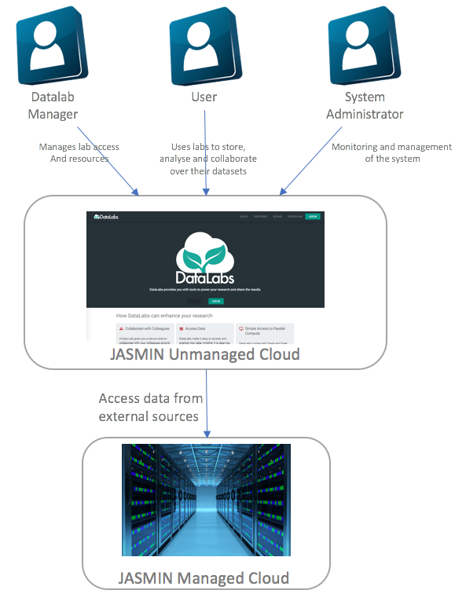

# Datalabs Context

This section details the context that the Datalabs project operates within.

* **[Platform context](#platform-context)**
* **[User types](#user-types)**
* **[Associated systems](#associated-systems)**
* **[Related sections](#related-sections)**

[Return to overview](./01-architecture-overview.md)

## Platform context

The Datalabs platform context is shown below:

## User types

The user types for Datalabs have not been fully defined and is expected to evolve. This
section describes the four different types of user that have been identified:

* **Instance Administrator** - Instance administrators have full, unrestricted access to
datalabs.
* **Project Administrator** - Project administrators will have administration permissions
within a single project but not across projects. Note: Projects functionality has not yet
been implemented so this role does not exist in practice.
* **Project User** - Project users have permissions to use the full datalabs
functionality within the context of a project but will likely not have the ability to
perform administration tasks.
* **Project Viewer** - Project viewers will have read only access to resources to which
they have been granted access. This is primarily expected to be used for content that
has been published but not for public access.

## Associated systems

The platform needs to interact with a number of types of external systems:

* __JASMIN OpenStack__ - Datalabs is deployed into an `unmanaged` cloud tenancy in
JASMIN.
* __JASMIN GWS__ - Datalabs will be required to operate on large datasets that users have
stored in their managed Group Workspace tenancy.
* __Auth0__ - Datalabs makes use of a third party identity provider to avoid having to
build this functionality.

## Related sections

[Functional View](./03-architecture-functional.md)
