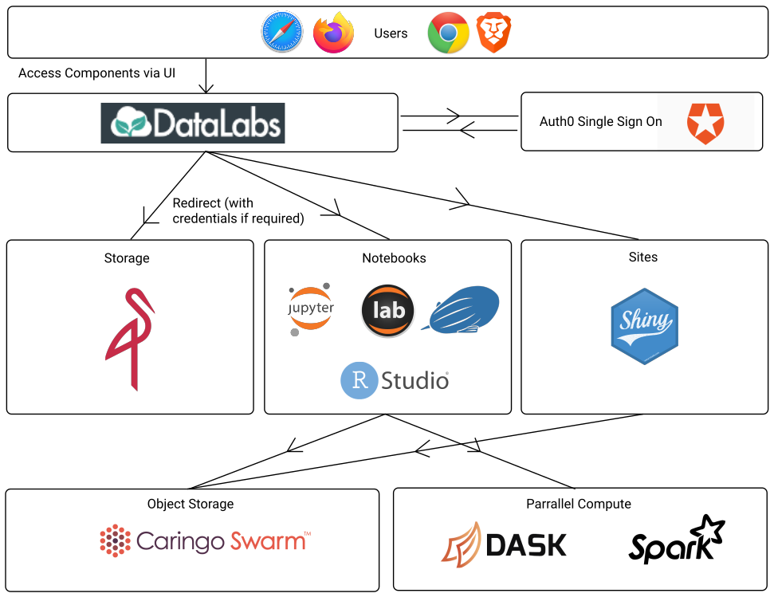
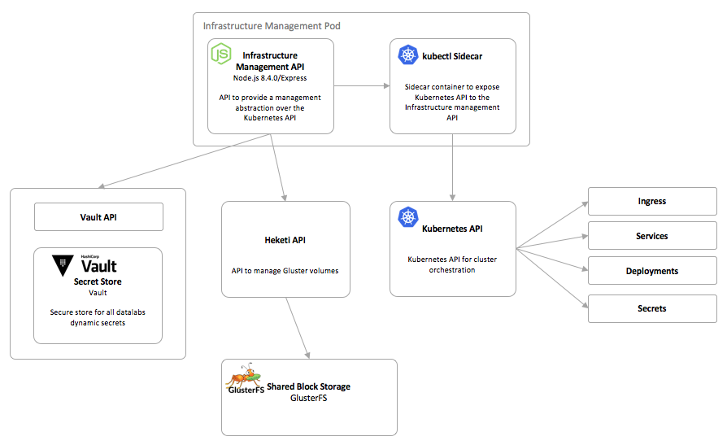

# Functional View

This section details the datalabs architecture from the view-point of its functional
structure.

* **[Datalabs context](#platform-context)**
* **[High-level components](#high-level-components)**

[Return to overview](./01-architecture-overview.md)

## Platform context

The Datalabs context is [covered here](./02-architecture-context.md). This section
builds on that context.

The Datalabs system is a system that allows users to dynamically construct their own
system within the confines of a datalabs project. Given this each of these architectures
will be considered independently.

## User Architecture

The Datalabs system exists to allow users to construct their own data analysis platform
from the underlying building blocks provided to them. An example configuration is shown
in the diagram below and this section describes each of the pieces that a user can
provision as part of a datalab.

### User Environment

Datalabs is intended to be a purely browser based application. This means that all access
to data and compute must be through browser applications. Datalabs itself is a system for
providing self service to the users to provision their own instances of third party
applications. It is possible that in the future some core functionality might be through
datalabs directly (e.g. file management) but this is expected to be the exception rather
than the norm.

### Notebooks & Sites

Notebooks and Sites form the core of the user experience. A number of different data
analysis tools have been identified in this space and the intention is to give the user
as wide a choice as possible to increase adoption. Broadly, there are two categories of
tools, those for performing data analysis and those for publishing it. The current list
of identified Notebooks is below along with whether they are currently available in
datalabs:

* [Jupyter Notebooks](http://jupyter.org/) - Implemented
* [Zeppelin Notebooks](https://zeppelin.apache.org/) - Implemented
* [RStudio Server](https://www.rstudio.com/products/rstudio/) - Implemented
* [Juptyer Lab](https://github.com/jupyterlab/jupyterlab) - Not Implemented, recent
upgrade to Jupyter notebooks
* [Cloud9 IDE](https://aws.amazon.com/cloud9/) - Not Implemented

The list of identified Sites is as follows

* [RShiny](https://shiny.rstudio.com/) - Implemented
* [NBViewer](https://github.com/jupyter/nbviewer) - Implemented
* [Thredds](https://www.unidata.ucar.edu/software/thredds/current/tds/) - Not Implemented
* [Nginx](https://nginx.org/en/) - Not Implemented

### Storage

A datalab storage volume is presented to a user as a regular file system that is shared
across any containers that they mount it into. By presenting storage in a way that the
user is familiar with the barrier to adoption is lowered. It is expected that in the
future Datalabs will support other forms of user provisioned storage, this could
potentially include Object Storage (e.g. S3) or databases.

### Distributed Compute

One of the driving forces behind datalabs is to provide users easy access to distributed
computed clusters. Two different compute clusters are deployed with datalabs.

* [Spark](https://spark.apache.org/) - Implemented
* [Dask](https://dask.pydata.org/en/latest/) - Implemented

### External Data Integration

In order to make Datalabs accessible users it will need to be able to integrate with
external data sources. This is still an area that is being explored, but the first
integration that has been added is with data exposed via a Thredds server. A Datalabs
instance could pull data from and accessible Thredds server but initial focus has been on
Thredds servers exposing data stored in JASMIN Group Workspaces (GWS).

## Containers

The high-level containers that the platform will need to fulfill the demands of its
context are shown below. Each of the containers is described in the sections that follow.

### Ingress Controller

Kubernetes provides an [Ingress](https://kubernetes.io/docs/concepts/services-networking/ingress/#ingress-controllers)
abstraction to manage external access to service in a cluster. Typically services and
pods have IP addresses that are only routable by the cluster network. All traffic that
ends up at an edge router is either dropped of forwarded elsewhere. An Ingress is a
collection of rules that allow inbound connections to reach cluster services. In
Datalabs, Ingress Rules are used to bind sub-domains of the base datalab instance
domain to user created services.

Kubernetes only provides an abstraction for Ingress, it does not provide the
implementation. This means that is is necessary to install and configure an
`Ingress Controller`. Datalabs is using the [Nginx Ingress Controller](https://kubernetes.github.io/ingress-nginx/).
There are a huge range of configurations options that can be set for both ingress
controllers and ingress rules. These are all detailed in the Ingress Controller
documentation. Datalabs current uses the following features:

#### Ingress Authorisation

Third party services are dynamically provisioned into datalabs that do not provide any
security controls. The ingress authorisation functionality provides a mechanism to apply
per request authorisation checks by setting annotations on individual ingress rules.

The request is passed unmodified to an authorisation service that can perform any checks
required to determine whether the request is authorised. If the request can proceed then
the service should return a `200` if the user is unauthorised then the service should
return a `401`. In the case that the user is unauthorised the ingress controller can
then redirect the user to a sign in page with the original request url appended as a
query parameter (`?rd=`).

Two rules are used in combination to achieve this (Note: these were correct for version
`0.9.0-beta.15` currently deployed but have changed in a recent release of the Nginx
Ingress controller):

* ingress.kubernetes.io/auth-url - The url for the authorisation service. Note that due
to quirks of Kubernetes DNS this has to be a full DNS name not just a simple service
reference (e.g. http://datalab-auth-service.default.svc.cluster.local)
* ingress.kubernetes.io/auth-signin - The public facing url for the application sign in
page.

#### Ingress Rewrite

For some applications it is expected that they are served on the root of the domain (`/`)
but for datalabs purposes we want to serve it on a different url. In this situation, a
rewrite rule is required to modify the request as it is passed down to the underlying
container.

The rule that achieves is this `ingress.kubernetes.io/rewrite-target` which is optionally
set during stack creation for the stacks that require it.

### Datalabs Web Application

The datalabs web application is a Single Page Application (SPA) built using
[React](https://reactjs.org/). The application is built on top of the
[create-react-app](https://github.com/facebook/create-react-app) template project and
has not been ejected.

The React code is web packed to static HTML and JavaScript and served from an Nginx web
server.

### Datalabs API

The datalabs API is the server API to provide data to the web application. The API
is a GraphQL interface running in Node. The use of GraphQL provides benefits as its
resolvers mechanism makes it easier to combine the results of multiple underlying
service requests.

### Infrastructure Management API

The infrastructure management API provides an API to manage collections of Kubernetes
resources to meet user requests for Datalabs resources. This API is a simple REST API as
no aggregation of underlying requests is required.

The infrastructure service communicates with Kubernetes through the Kubernetes API which
allows the management of any Kubernetes resources. The resources that are currently
orchestrated are:

* Ingress
* Service
* Deployments (inc ReplicaSets and Pods)
* Secrets
* PersistentVolumeClaims (inc PersistentVolumes)

#### Kube Watcher

The infrastructure management service accepts requests to create and destroy datalabs
components and issues the appropriate Kubernetes manifests to the Kubernetes API to
achieve the desired state. Requests to the Kubernetes API result in changes to the
underlying Etcd data store. Separate Kubernetes processes then work to ensure that the
desired state is achieved. The response is sent immediately, before any changes have been
applied to the underlying infrastructure which can result in a bad user experience as
a user may try to open a web page before the server has finished initialising. This is
particularly true for the larger containers that can take some minutes to download from
Dockerhub the first time a container is started on a node.

The Kube Watcher service connects to the Kubernetes event API via the Kubectl ambassador
proxy. It filters for events on user created pods and updates their current state in the
underlying Mongo database store that is queried to serve data to the datalabs
application. The service performs a regular reconciliation across all known containers to
ensure that the state doesn't drift as events in the event stream are ephemeral (it is
not possible to view historical events) so if events are missed the state could be
incorrect.

An option considered was to rely on the Kubernetes API and Etcd as the provider for this
information rather than store in an independent data store. This was ruled out as we
anticipate having different sources of this information in the future (for example if)
we also have to query for the state of user provisioned virtual machines.

The Kube Watcher service is a small node service packed into the infrastructure container
but run in a separate container in the same pod.

#### Kubectl Proxy

In order to communicate with the Kubernetes API it is necessary to authenticate. Given
it is served over HTTPS using self signed certificated is is also necessary to add the
CA certs to the client if accessing it directly. Given this, an `ambassador` pattern is
adopted. An ambassador container is a small container that runs in the same pod with the
intention to proxy a local connection to the world. See
[Container Patterns](https://kubernetes.io/blog/2015/06/the-distributed-system-toolkit-patterns/).

In this case the ambassador container needs to provide authentication to Kubernetes and
this is easily possible using the `kubectl` command line tool as this provide a proxy
command that starts a local proxy to the Kubernetes API. Authentication can then be
injected using a container service account.

All containers that run in the same pod are on the same localhost network. This allows
the infrastructure service to then communicate to the Kubernetes API via
`http://localhost` rather than over HTTPS on an external interface and does not need to understand how authenticate and authorisation takes place.

The [docker-kubectl](https://github.com/NERC-CEH/docker-kubectl) has been created to
provide a deployable kubectl ambassador.

### Authorisation Service

The authorisation service performs several roles:

* Handles requests from the ingress controller where the rules have annotations
requiring authorisation. In this case the service currently simply checks that the user
is an authenticated Datalabs user but this is expected to be extended to perform
authorisation checks in the future. These requests are handled on the `/auth` route.
* Handles the generation of `service tokens` that are then used internall to ensure that
users have the correct permissions.
* Provides an API to retrieve user profile information from Auth0.

### Authentication Service

Authentication is handled by [Auth0](https://auth0.com/). This provides the following
functionality:

* User authentication - OAuth flow embedded in the web application.
* User management (roles/groups) - User addition/removal is available through core Auth0
functionality. User groups management is available through the authorisation extension.
* Federated login - Auth0 provides the ability to federate with many different identity
providers. This means that it is possible to add different identity sources without
requiring any application changes.
* API authentication token management - Auth0 provides API configuration to allow API
authorisation tokens to be issued as part of the authentication process avoiding the need
for the datalabs system to have to generate them and allowing it simply to verify the
signature against the public JWKS certificate.
* Direct API access token management - The authorisation service retrieves information
about users, groups and permissions from two Auth0 APIs. These are the
[Auth0 Management API](https://auth0.com/docs/api/management/v2) and
[auth0-authorization-extension-api](https://auth0.com/docs/api/authorization-extension).
* User profile information - User profile information can be managed for users
provisioned in Auth0. For users provisioned in other systems only the `app_metadata` can
be used to add additional information but this is not currently used by datalabs.
* Authentication Rules - Rules can be used to enrich user profile information one a user
has asserted their identity. Datalabs has a single rule provisioned by the
authorisation extension that adds user roles to the profile.

### Default Backend

The default backend is a container that serves requests that do not match to any existing
ingress rules. It is essential a wild card HTTP `404` server. The service is a tiny
Node.js Express application that serves a status endpoint and static page with a `404`
response.

Given the service was not anticipated to change frequently it has been separated into a
different [docker-default-backend](https://github.com/NERC-CEH/docker-default-backend)
repository.

### Vault

[Hashicorp Vault](https://www.vaultproject.io/) is used to store dynamic secrets within
the datalabs system. Vault provides secure storage and an API for authorised access.

Further details are contained in the [Security View](./05-architecture-security.md#hasicor-vault)

### MongoDB

[MongoDB](https://www.mongodb.com/) is used as the underlying storage for persistent
datalabs data. In the current configuration is is run as an unreplicated Kubernetes pod
as the Stateful set configuration didn't bring enough value for the investment. In the
case of failure the Pod would restart and only a short database interruption would be
incurred.

### Gluster

Datalabs offers users the capability to provision dynamic storage that can be mounted
into multiple containers. This means that a Kubernetes volume plugin that supported
`ReadWriteMany` was required. Kubernetes provides a list of
[volume plugins](https://kubernetes.io/docs/concepts/storage/persistent-volumes/).
The easiest choice available was simple NFS, However, no backup capabilities are
provided to Datalabs from JASMIN so a scalable, distributed file system seemed to be a
better choice as this would give at least some resilience against failure.

The team had no prior experience of distributed storage and elected to use
[Gluster](https://www.gluster.org/) as it seemed to be an established option.

### Heketi

Kubernetes provides an abstraction over storage and provides three different primitives:

* StorageClass - The configuration of a type of storage to use
* PersistentVolumeClaim - A representation of the binding between a container and a
particular persistent volume. This is essentially a marker to avoid storage being either
deleted or consumed by a different container in the case where the container it is
allocated to stops.
* PersistentVolume - An allocated block of storage of a particular storage class.

Gluster itself is easy to install, configure and consume from Kubernetes. Unfortunately,
this only provides static storage volumes and does not meet the requirements of datalabs.
This means that it is necessary to add an API that allows Kubernetes to manage the
underlying storage. [Heketi](https://github.com/heketi/heketi) is the official API for
this but is incredibly difficult to get configured in a bare metal cluster. The
[gluster-kubernetes](https://github.com/gluster/gluster-kubernetes) project has proven
to be very valuable in getting Heketi running and this has been wrapped into Ansible
scripts to provide automated installation.
