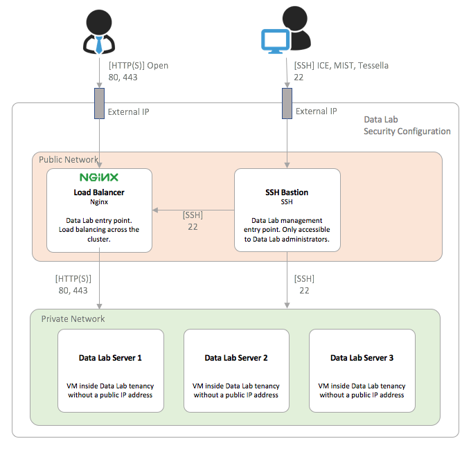
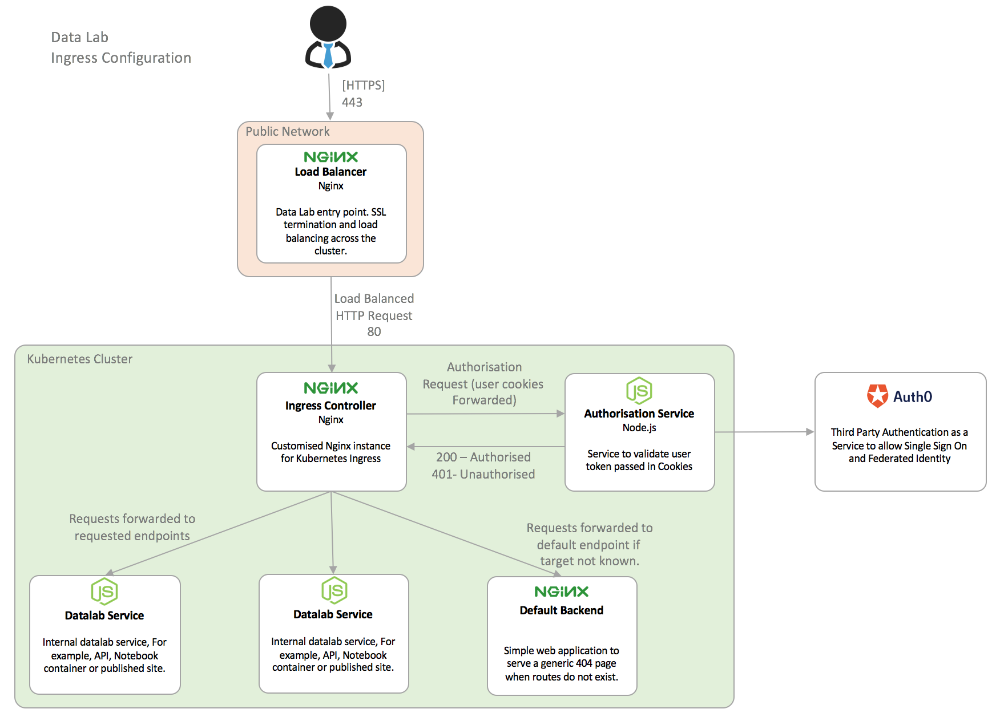
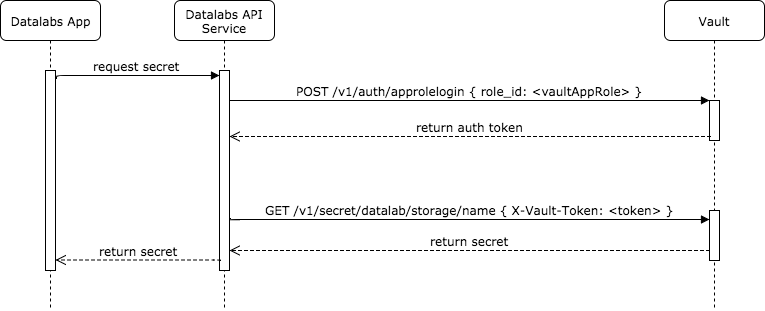
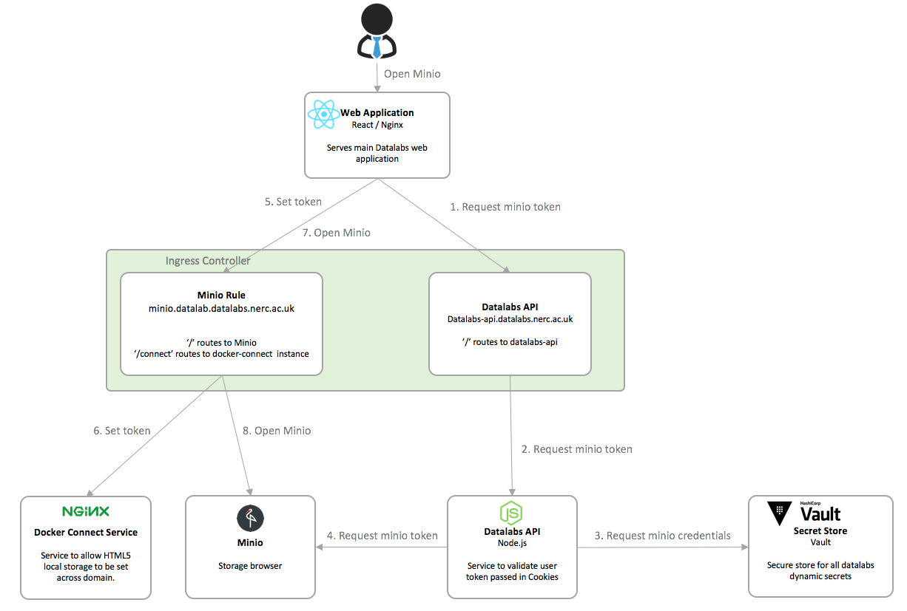

# Security View

This section details the Datalabs architecture from the view-point of its security.

* **[Cluster security](#cluster-security)**
* **[Server security](#server-security)**
* **[Authentication and Authorization](#authentication-and-authorization)**
* **[Secret management](#secret-management)**

* **[Trust zones](#trust-zones)**
* **[Data security](#data-security)**


## Cluster Security

The Datalabs system is hosted in a [JASMIN](https://help.ceda.ac.uk/collection/59-jasmin-documentation)
unmanaged cloud tenancy. This means that we are provided with an isolated 192.168.3.0/24
network space providing 256 IP addresses. There are also three public IP addresses that
can be allocated within the tenancy allowing traffic from the public Internet to reach
our servers.

The cluster is separated into two logical subnets, a public subnet that is accessible
from the public Internet and a private subnet that is not accessible from the public
Internet. There are actually three servers in the public subnet as there are two load
balancers, one for test and one for production traffic.

The diagram below shows this configuration and the allowed network
communication between nodes. This is discussed further below.



### Public Subnet

The public subnet contains two logical servers per instance of Datalabs. These are both
given external IP addresses and connected to NAT instances through the Ansible vCloud
provisioning.

* **Load Balancer** - The Ubuntu load balancer server receives all inbound user traffic
on ports 80 (HTTP) and 443 (HTTPS). Traffic is then streamed using the [Nginx stream](https://docs.nginx.com/nginx/admin-guide/load-balancer/tcp-udp-load-balancer/)
module and load balanced across all the Ingress service on all Kubernetes worker nodes.
* **SSH Bastion** - The Bastion server is a simple Ubuntu server is configured with a
public IP address and accessible via the public Internet. The firewall is restricted to
allow incoming traffic on only port 22 for SSH from a small number of locations. This
list is currently only ICE and MIST (Linux Desktops at RAL) and Tessella's public IP
address for both Internal and VPN networks. The list is defined in the Ansible bastion
`group_vars` and would require rerunning the provisioning to alter the list. It must not
be altered manually as a bastion rebuild would reset the values. If a

### Private Subnet

The private subnet contains all of the remaining Datalabs servers that comprise the
Kubernetes and GlusterFS clusters. The firewalls for these machines are configured to
accept inbound traffic on ports 80 and 443 from the public servers and on port 22 from
the bastion server.

#### Access to servers in private subnet

In order to access servers in the private subnet it is necessary to jump through the
bastion server. This is easy to do on MacOS or Linux as SSH is a first class citizen.

The direct method is to first SSH onto the Bastion server forwarding SSH credentials
(`-A`) and then SSH on to the target machine.

```bash
ssh -A -i ~/.ssh/<ssh_private_key> deploy@<bastion_ip>
ssh deploy@<internal_server_ip>
```

A better way is to add SSH configuration to you SSH config file to allow single step
access. An example configuration for the same access is:

```bash
Host bastion
        # shuttle.name = Datalabs/Bastion
        HostName <bastion_public_ip>
        User deploy
        IdentityFile ~/.ssh/<private_key>
        ForwardAgent yes

Host k8s-master
        # shuttle.name = Datalabs/k8s-master
        HostName <internal_ip>
        User deploy
        ProxyCommand ssh bastion -W %h:%p
```

This then allows SSH access using a simple `ssh k8s-master`.

> **Note |** SSH on a Windows machine is a sorry story. MobaXterm provides a good
starting point but its support for SSH tunneling is limited. If you are supporting
Datalabs and trying to use Windows we strongly recommend that you stop and get a proper
operating system.

#### SSH Tunnel to internal services running in private subnets

In order to access services running inside a private subnet it is necessary to set up an
SSH tunnel from a port on the local machine. There is an excellent paid tool for this on
MacOS called [SSH Tunnel](https://itunes.apple.com/gb/app/ssh-tunnel/id734418810?mt=12).
This allows for easy configuration of tunnels and ensures that they stay open.

On Linux these are configured using the SSH config in the same way as the SSH connections
but to ensure that they stay open a utility called AutoSSH can be used. To configure the
tunnel add another block to the SSH config. An example for the Kubernetes API:

```bash
Host k8s-tunnel
  HostName <bastion_public_ip>
  User deploy
  ForwardAgent yes
  ControlPath=~/.ssh/ssh2k8s-%r@%h
  ControlMaster=auto
  IdentityFile ~/.ssh/<private_key>
  LocalForward 6443 <k8s_master_internal_ip>:6443
  ServerAliveInterval 30
  ServerAliveCountMax 3
```

Then run `autossh` to open the tunnel. This will open the tunnel and ensure that it stays
open.

```
autossh -M 0 -f -T -N k8s-tunnel
```

This would then allow connections to the Kubernetes API running on a private internal
server to be accessed on `localhost:6443`.

## Server Security

In addition to the network configuration described above, all servers are provisioned
using a base security configuration that does the following:

* **Reconfigures root user** - Updates the root password, disables password
authentication, disables root SSH access and optionally changes the SSH port (unused).
* **Adds deploy user** - This user is common across all machines and is the account that
the Ansible provisioning uses. This user can access using SSH from allowed locations and
is added to the sudoers list.
* **Updates Hosts file** - Add all servers in cluster along with their names to allow
DNS lookups to function correctly.
* **Configure Firewall for SSH** - Update the Ubuntu Uncomplicated Firewall (ufw) to
allow SSH access from all management IP addresses.
* **Configure APT auto updates** - Ensure that security patches are applied to the
servers.
* **Configure email summaries** - Configure email summaries to be sent by logwatch. NOTE:
The email configuration on this isn't currently working and was left as the move to
OpenStack may resolve this.

## Authentication and Authorisation

The Datalabs system has a complicated authentication and authorisation architecture due
to the number of different components and different types of access. This section covers the following topics:

* **Authentication using Auth0**
* **Authorisation tokens**
* **Authorisation Service**
* **Ingress Authorisation**
* **Single Sign On**

### Authentication using Auth0

We have selected to use [Auth0](https://auth0.com/) to provide authentication as a
service. As OSS we are provided with the full Auth0 service free or charge and this has
provided us an alternative to implementing user management and authentication. It also
offers powerful capabilities for integrating with third party Identity Providers (IdP)
which would provide an easy option to integrate with our users existing systems.

Auth0 provides many different capabilities but we are using only a small number in the Datalabs system:

* **Clients** - an Auth0 client defines a client that will use Auth0 to authenticate a user.
* **APIs** - an API can be consumed from a client with Auth0 managing the authentication
flow.
* **Connections** - Connections represent an IdP. We are currently making use of the
Auth0 provided database but intend to extend this to include other types of connections
if needed by our target organisations.
* **Extensions** - Auth0 provides an extension mechanism and a library of existing
extensions. We are using the [Auth0 Authorisation](https://auth0.com/docs/extensions/authorization-extension/v2)
extension to provide an easy way to define roles and assign them to users.

#### Clients

Datalabs has a number of Auth0 clients for different components:

* **datalab-app** - The main Datalabs web application client. Used by the application to
authenticate the user and retrieve the `authorization_token` and `id_token`.
* **Datalab Authorisation API** - Client for accessing the Authorisation extension. Used
by the Authorisation service to retrieve user role information
* **Discourse** - Client for Discourse instances. Allows users to authenticate against
Discourse using the same credentials.
* **auth0-authz** - Create and used by the Authorisation extension. Not consumed directly
by datalabs.
* **API Explorer Client** - Not needed by the application, created to allow admin access
to the Auth0 API. This has only been used once, to set an inaccessible flag on the
`datalab-api` for `is_first_party: true` to stop it showing the consent dialog to new
users.

From the Auth0 dashboard it is possible to retrieve (or change) the Client ID, Client
secret, Allowed Callback URLs, Allowed Logout URLs. The test and production Datalabs
instances currently both share the same client but in the longer term this should be
chanaged.

#### APIs

Datalabs has three APIs defined in Auth0:

* **datalab-api** - The API resource representing the GraphQL aggregation API. Auth0
provides a [tutorial](https://auth0.com/docs/quickstart/spa/react/03-calling-an-api) on
how to configure and consume this.
* **auth0-authorization-extension-api** - Created and used by the Authorisation
extension.
* **Auth0 Management API** - Not needed by the application, created to allow admin access
to the Auth0 API.

#### Connections

Datalabs has a single Database Connection called `Datalabs`. This provides a simple
database of users who can access the application. User sign up has been turned off so
new Datalabs users can only be added by an Auth0 admin.

#### Extensions

Datalabs makes use of the Auth0 Authorisation Extension to provide an easy way to define
roles and assign them to users. These are in turn used to map to permissions within the
scope of the authorisation service and the process for this is defined below in
[#authorisation-service].

### Auth Tokens

The system uses three types of authentication and authorisation token. These are:

* Identity Token - This asserts the users identity and is issued by Auth0.
* Authorisation Token - This is issued alongside the identity token and provides the user
the permission to call the API service.
* Service Token - This is generated by the authorisation service in exchange for an
authorisation token.

All three tokens are signed JSON web tokens and their payload designs are described
below.

The following diagram shows the authentication and authorisation flow in the application.
Note that only identity and authorisation tokens are ever returned to the client and that
service tokens are generated per request and only ever exist server side. There is no
reason why permissions token couldn't be returned to the client as they are signed JWT
tokens. This separation was made to reduce the per request overhead of sending the token
from the client.

//TODO TOKEN FLOW DIAGRAM.


#### Identity Token

The identity token is issued by Auth0 and is compliant to the Open ID Connect (OIDC)
[specification](http://openid.net/specs/openid-connect-core-1_0.html#IDToken).

The requested scopes on the token are limited to just `openid` and `profile` as
permissions are handled through the authorisation service and service tokens.

```json
{
  "iss": "https://mjbr.eu.auth0.com/",
  "sub": "auth0|<user-id>",
  "aud": [
    "https://datalab-api.datalabs.nerc.ac.uk/",
    "https://mjbr.eu.auth0.com/userinfo"
  ],
  "iat": 1528091768,
  "exp": 1528127767,
  "azp": "<client-id>",
  "scope": "openid profile"
}
```
#### Authorisation Token

The authorisation token is issued by Auth0 alongside the ID token and contains the
following payload:

```json
{
  "nickname": "<name>",
  "name": "<email>",
  "picture": "<gravatar_url>",
  "updated_at": "2018-06-04T05:56:06.450Z",
  "iss": "https://mjbr.eu.auth0.com/",
  "sub": "<user-id>",
  "aud": "<client-id>",
  "iat": 1528091768,
  "exp": 1528095368,
  "at_hash": "el5hZIB81mkR20HuaQUKOA",
  "nonce": "d-4HG8mYqgKPdfbMt7nCw3Z3qpN5g1sQ"
}
```

#### Service Token

The service token is issued by the auth service in exchange for an authorisation token.
The service token contains the `sub` (userId), `roles` and `permissions` for the user.
These are looked up as shown in the diagram below. Once the user has been verified by
their authorisation token, the Auth0 authorisation extension API is used to identify the
roles for the user.

##### User Roles

There will initially be four user roles:

* **Datalab Administrator** - A Datalab administrator will have access to all functionality within a single instance of a datalabs system. This will include user management and the creation of projects.
* **Project Administrator** - A project administrator will have access to all functionality within a project. This will include managing users, possibly higher level data management and the ability to see all notebooks and sites for all of the project users. Volume creation and deletion may be project admin level functionality.
* **Project User** - A project user will be a regular user of the system. the will be able to create notebooks and sites but will not be able to see other users content.
* **Project Viewer** - A project viewer will have limited access to a datalab project. They will not be able to create notebooks or sites but will be able to access any sites that have been shared with them.

##### Managing User Roles

Users may have different roles in different projects which breaks the Auth0 model for how permissions are calculated. In Auth0 if a user was assigned the administration role in one project and a viewer role in the other then it would return a flat list of all permissions from which it would not be possible to distinguish. Given this, the project information will be encoded into the role name by concatenating the project key and role name separated by `:`.

```
admin # Datalab Admin
example:admin # Admin for project example
example:user # User for project example
example:viewer # Viewer for project example
```

A hierarcy of roles to allow permissions to be grouped in sensible ways may be required but this will be reviewed later.

##### Permissions

Permissions are associated to specific actions on resources. These will be encoded into a `:` separated string as `<action>:<resource>`. For example, the creation of a notebook would require the permission `create:notebook`.

A list of all permissions and how they map to roles will be maintained in the authorisation service. This is injected as configuration so adding new permissions does not require the authorisation service to be rebuilt. A service restart is required to
reload the configuration and a database would make sense in the long term if permissions
are available for configuration through the UI. This solution is sufficient for the
current requirement.

##### Example payload

```json
{
  "sub": "<user-id>",
  "roles": [
    "projecta:role",
    "projectb:role"
  ],
  "permissions": [
    "firstProjectName:stacks:list",
    "firstProjectName:stacks:open"
  ]
}
```

##Authorisation Service

The authorisation service provides an API to allow any service to query whether a specific user has a specified role. All services should be responsible for authorising requests made to them.

Auth0 API calls are severely rate limited and performance is poor the result of the user roles look up is cached in memory with a short TTL.

##Ingress Authorisation##

Datalabs creates and manages many Docker containers running inside Kubernetes Pods to
serve web applications on user specified sub domains. Some of these systems do not
provide any easily configurable user authentication and should not be served as public
applications given Datalabs is an Internet facing application.

Kubernetes Ingress controller authorisation is used to protect all resources created
unless they are explicitly intended to be open to unauthenticated users. The diagram
below shows the path a request takes through the system when the Kubernetes `IngressRule`
is annotated with the following authorisation annotations

```
apiVersion: extensions/v1beta1
kind: Ingress
metadata:
  name: svcName
  annotations:
    ingress.kubernetes.io/auth-url: authSvcUrl
    ingress.kubernetes.io/auth-signin: appSigninUrl
```



A request from the browser reaches the public facing load balancer and is directed to
the ingress controller service on one of the Kubernetes nodes. Here, if the domain
matches and ingress rule the processing continues otherwise the user id redirected to
the `Default Backend`. If the rule matches and there are no `auth` annotations the
request is passed directly to the specified service. If there are annotations then the
request is passed as is to the specified authorisation service for further processing to
decide whether the request should be served or not. The authorisation service can apply
any checks required and must only return a 200 to allow the request to continue or a 401
if the user is determined to not be authorised.

The existing authorisation service has been reused to service ingress authorisation
requests. The user identity is passed in on a cookie that is dropped on the base domain
and so served with all requests from user generated containers provided the user has
logged in.

> Note: The initial implementation applies a basic check to ensure that the user is
logged in to datalabs but does not perform checks to see if the user is able to see the
resource at the specific URL. This needs to be extended.

##Single Sign On

Several of the containers that users can provision provide their own authentication
mechanisms. We do not want users to have to remember many different sets of credentials
so these are generated automatically with container creation. The credentials are
stored in Hashicorp Vault and then loaded dynamically and injected using an appropriate
mechanism depending on the container.

The flow for creating and retrieving credentials and the different mechanisms are
described in the rest of this section.

### Hashicorp Vault

Vault is a tool for securely storing secrets. It provides an API for storing, updating
and retrieving secrets and has the ability to specify fine-grained access control and
access auditing. Datalabs only makes very limited use of its capabilities and this is
expected to extend if we need to control access to different sorts of resources. The
biggest feature that we use is the capability to `seal` a Vault either when the Vault
restarts or, in the future on intrusion detection. Unsealing a Vault requires one or
more keys that can be sharded across administrators.

Pods are provisioned with an `APP_ROLE` that can be exchanged with Vault for an
`access_token` which in turn can be use to request the required `secret`. This is shown
in the diagram below.

//TODO


Secrets are stored in a path structure by Vault. The first part of the path determines
the type of resource. Datalabs uses the simple `/secret` type and this forms the base
of the path. The rest of the path is specified by datalabs and is:
`<datalab-name>/<resource-type>/<resource-name>`.
For example `thedatalab/stacks/myjupyter` for a datalab called `thedatalab` and a Jupyter
container called `myjupyter`.

### Seamless log on

Several different mechanisms are in place to provide seamless log on to different types
of containers. This section details the mechanism in place for each specific type.

#### Jupyter

Jupyter authentication is via a token passed on the URL as the site is opened. The token
required is set at container start and is stored in Vault. To achieve seamless login,
the datalabs application needs to retrieve the token from Vault and then open the url
in a separate browser tab.

No additional containers are needed for seamless login to Juptyer.

#### Minio

Minio authentication is via an authorisation token that is stored in HTML5 local storage.
To achieve seamless login, the datalabs application needs to retrieve a valid
authentication token from the Minio API and store this in the correct place in local
storage such that Minio picks it up in subsequent API requests.

The datalabs web application and all Minio storage containers run on different
sub-domains. Browser security means it is impossible to directly set local storage across
domains. This means that a more complex mechanism is required to achieve this.

Given we have full control over request routing for our wildcard domain it is possible to
present an endpoint on the same sub-domain to allow a value to be stored in local storage
that is passed as parameters on a GET request from an authorised domain. This is
implemented in the `docker-connect` [project](https://github.com/NERC-CEH/docker-connect)
which is a tiny static web application served from an Nginx container. An open source
library called [Cross Storage](https://github.com/zendesk/cross-storage) has been used
to provide this interface.

Requests to the specific Minio sub-domain are routed based on path using Ingress rules.
This configuration means that the datalabs application can perform the following steps to
open a Minio browser with seamless log in:

* Retrieve the access key and secret key for the Minio instance from Vault.
* Aquire an authentication token from Minio using the access key and secret key.
* Store the token in HTML5 session storage using Cross Storage.
* Open Minio in a new browser tab.



#### Zeppelin

Zeppelin authentication is via an authorisation token that is stored in an HttpOnly
cookie. To achieve seamless login, the datalabs application needs to retrieve a valid
authentication token from the Zeppelin API and drop the required token such that Zeppelin
picks it up in subsequent requests. Zeppelin expects a cookie with the following
structure:

```
Set-Cookie: JSESSIONID=<token>; Path=/; HttpOnly
```

Browser security means that it is only possible to set an HttpOnly cookie by attaching it
to a response from the same sub-domain. This requires a similar but different approach to
Minio tokens described above.

A micro service is required to listen on a url, process the parameters passed in on the
URL and then construct and attach the appropriate cookie. This is implemented in the
`docker-zeppelin-connect` [project](https://github.com/NERC-CEH/docker-zeppelin-connect)
which is a tiny core Node.js application with no external dependencies. The resposne from
the connect container is a `302` redirect to immediately direct the user to Zeppelin to
avoid them seeing the response.

As for the Minio seamless logon, requests to the sub-domain are filtered by the Ingress
rule allowing requests to `/connect` to be redirected to the connect container while
requests to `/` are routed to Zeppelin.

#### RStudio

RStudio authentication works broadly in the same way as Zeppelin once an authentication
token has been retrieved. The token is attached to a request to a dedicated
`docker-zeppelin-connect` container and the appropriate token is dropped and the user
redirected to RStudio. The `docker-zeppelin-connect` container should be renamed to
`docker-cookie-connect` now it is shared, but this has never been prioritised.

Retrieving an RStudio authentication token is complex as individual login requests must
be signed using a certificate published by the RStudio server. The process is as follows:

* Request user credentials from Vault
* Request RStudio certificate
* Create, sign and submit log in request to retrieve authentication cookie
* Process cookie to parse required details
* Open connect in a new browser tab providing the appropriate query parameters to drop an
RStudio cookie
* Redirect to RStudio once the cookie has been dropped.

## Secret Management

In developing a large, distributed application is is necessary to provide many secrets
to the application for passwords, api tokens, certificates, etc. It is essential that
these are not stored in plain text in the code repository. Kubernetes provides a `secret`
abstraction that allows secrets to be created securely in the cluster in a way that
allows them to then be loaded into containers as environment variables at runtime.

Secrets are loaded into the cluster via Ansible scripts with the values stored securely
in encrypted ansible vaults.


