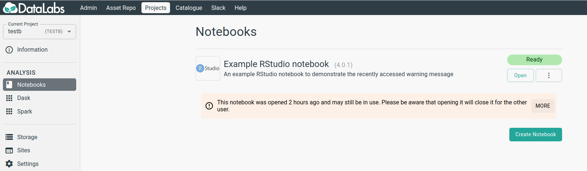

# Single use of a project's RStudio notebook #

## Why is this warning displayed? ##

This warns you that the RStudio notebook you are about to open 'may' be in use by another
user.  If the notebook has been opened recently (eg within the last 8 hours) then the
warning will be displayed.  This is important because if you proceed to open the notebook
then the current user will have their instance closed, causing some disruption to them.

## What does this warning look like ##

Here is an example of what this warning looks like.

## What should I do? ##

If you are aware of a colleague who may be using the notebook, it would be prudent to
discuss using it with them.
