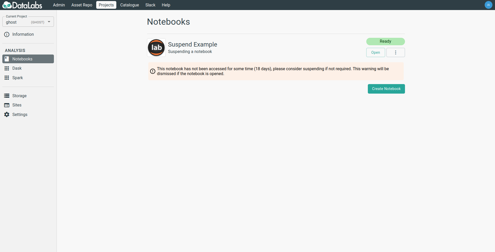
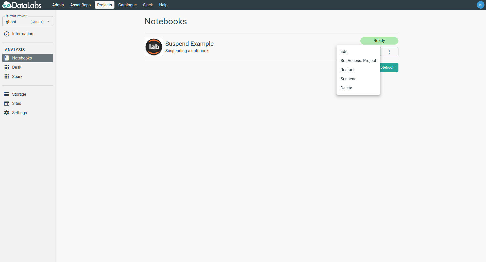
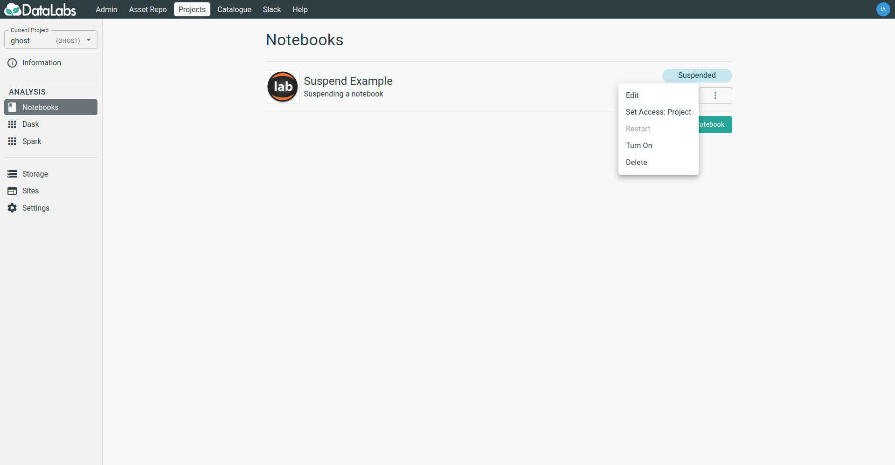

# How to Suspend and Restart Resources #

## Why suspend my resources in DataLabs? ##

When not in active use, notebooks, sites and clusters use a minimal amount of resources. By
suspending them it frees up this resource to be used by others.

## What does suspending a resource do? ##

Suspending a resource temporarily shuts it down, however no existing data or configuration
is lost. This takes a few minutes and will terminate the session of anyone using the
resources, once suspended the resource can be turned back on when required.

## Why are Notebooks automatically suspended? ##

Often people forget about resources they were previously working on. In order to prevent
these resources draining capacity, a basic timeout policy is being enforced which will
automatically suspend *notebooks*. This comes into affect only if it has not been accessed
(this is determined by the last time the user opened the resource through DataLabs) for
some time.

**NOTE: This does not affect sites, which often may sit idle for long periods of time
for good reason.**

## How will I know if a Notebook is about to be automatically suspended? ##

If a notebook has not been accessed in some time a warning will be clearly shown next to
the notebook in question.

## Can I manually suspend resources myself? ##

This is possible via the ellipsis button on the respective resources, the following can be
suspended/restarted at will;

* Notebooks
* Sites
* Compute Clusters

Once suspended, a resource can be restarted in a similar fashion.

## I need a Notebook to remain running ##

Please get in touch with us via e-mail or Slack if you need your resource to continue
running irrespective of access times.
