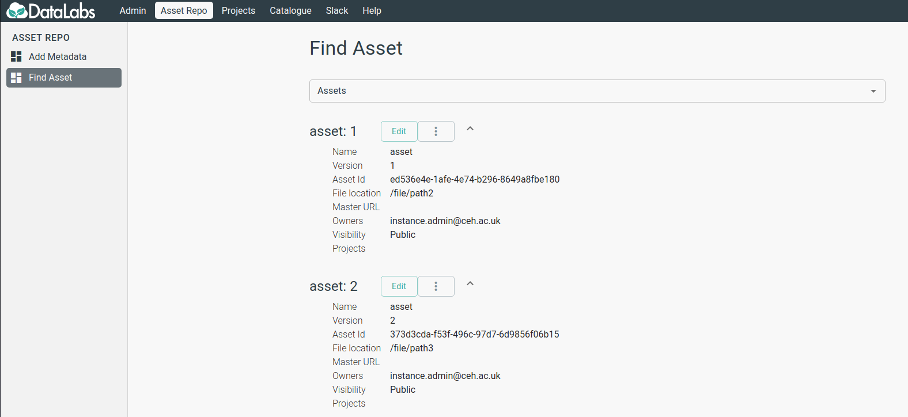
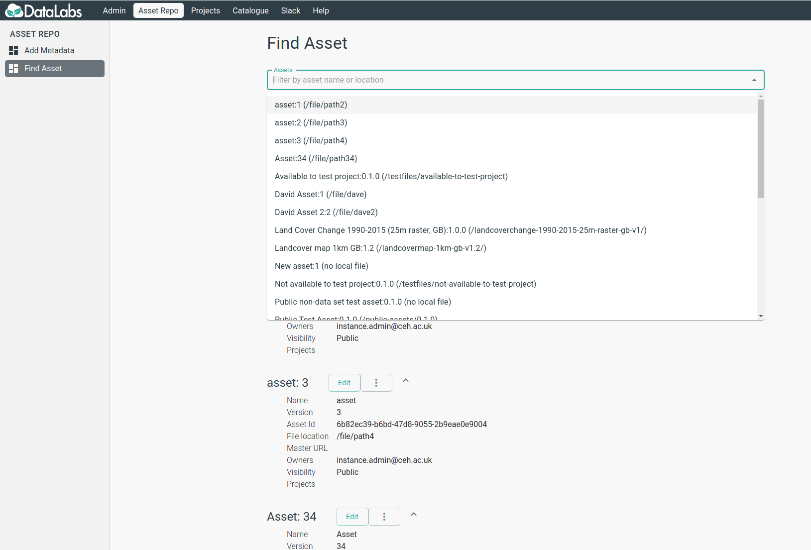
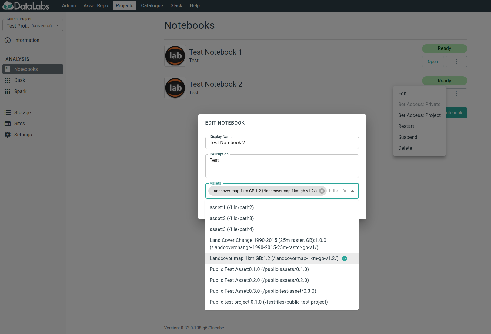

# How to use the Asset Repo #

## What is the Asset Repo? ##

The Asset Repo is a means to capture, share and use data across projects and with other users
in DataLabs.

## How do I use data in the Asset Repo? ##

From the home page select `Asset Repo`. This will take you to a page as seen below where
you can see all projects that are available to you (either they are classified as public,
or are available to projects that).



The following entries are associated with each entry;

* *Name* The name of the Asset.
* *Version* The version of the asset defined by the owner.
* *Asset Id* The internal ID of the dataset.
* *File Location* (For Admins) Where the data is stored on the storage server.
* *Master URL* Where you can find more about the data, or the original source of the
   data. This can be a DOI if the data is published elsewhere.
* *Owners* One or multiple users who are responsible for this asset within the DataLabs.
* *Visibility* Who can use this asset, either set to `Public` where anyone can access the
   data or `By Project`, where either one or a number of projects have access to the asset
   but no-one else.
* *Projects* If visibility is set to `By Project`, which projects can access the asset.

You can search the assets using the search box at the top, once you have selected an
asset you are interested in, use the Master URL to find out more about it if relevant.



If you have found an asset you would like to utilize. You can use it by either;

* Selecting the ellipsis and `Add to Notebook`.
* Browsing to a notebook of yours and selecting the ellipsis followed by `Edit`, and
  adding the asset to the notebook.
  (***NOTE***: Doing this will restart the notebook so any unsaved work should be saved.)



Once an asset is attached to a notebook, it will be accessible under within the `assets`
folder at the base of the notebook. By default this will be done for all newly created
notebooks.

Note when adding an asset to an older notebook prior to the release of the asset repo
this can be replicated by creating a symbolic link yourself from the base of the notebook
to the `/assets` folder as described below.

```bash
cd <Base Directory>
# For Jupyter this should be something like /data/notebooks/jupyterlab-<notebookname>
# or for RStudio the base of the project

ln -s /assets ./assets
# This creates a symbolic link from the base directory to the /assets mount point and
# allows it to be visible in the file pane
```

## Can I request a new asset to be hosted? ##

Yes, if there is an asset you would like to use yourself or would be useful to the wider
community get in touch with us on Slack or via e-mail. For certain datasets which are
hosted e.g in the EIDC catalogue, there may be considerations around licensing which will
prevent us from hosting a copy of the data however we will endeavor to help.

## Can I submit my own assets to be hosted? ##

Yes, as with requesting a new asset we are able to accept your own data to be hosted in
the Asset Repo and made available to others, get in touch with us directly to work this
out.

## Can I restrict assets data to my own project? ##

Yes, assets can be configured to be only accessible via specific projects if required.

## Can I use assets within sites? ##

Yes, assets can be attached to sites and detached from sites.  
[Click to see the details](attach-asset-to-site.md)  
