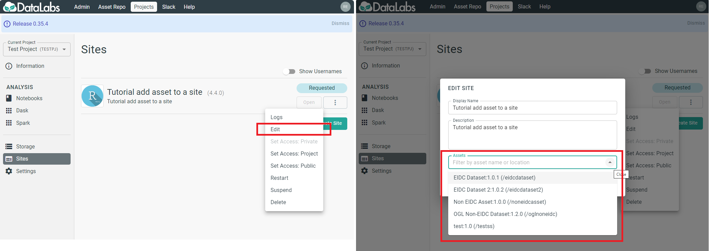

# Attach/detach assets to/from site

In this tutorial, you will attach an asset during and after site creation
 and detach it from the site.

It is recommended that you should already be familiar
 with any one of the materials in the tutorial.  
[My first Panel site](../../tutorials/getting-started-panel/index.html)  
or [My first Voilà site](../../tutorials/getting-started-voila/index.html)  
or [My first Streamlit site](../../tutorials/getting-started-streamlit/index.html)

## Attach an asset in creating site

From the "**CREATE A SITE**" popup, click on the "**Assets**" combo input
 to select an asset from the dropdown list or
 type in the combo input to select from a filtered list.

## Attach an asset after site creation

From the "**Sites**" page, select the ellipsis and choose "**Edit**",
 in the "**EDIT SITE**" popup, click on the "**Assets**" combo input
 to select an asset from the dropdown list or type in the combo input
 to select from a filtered list. then click "**Apply**".

## Detach an asset from a site

From the "**Sites**" page, select the ellipsis and choose "**Edit**",
 in the "**EDIT SITE**" popup, click on the cross icon by the asset
 to detach it from the site. then click "**Apply**".

