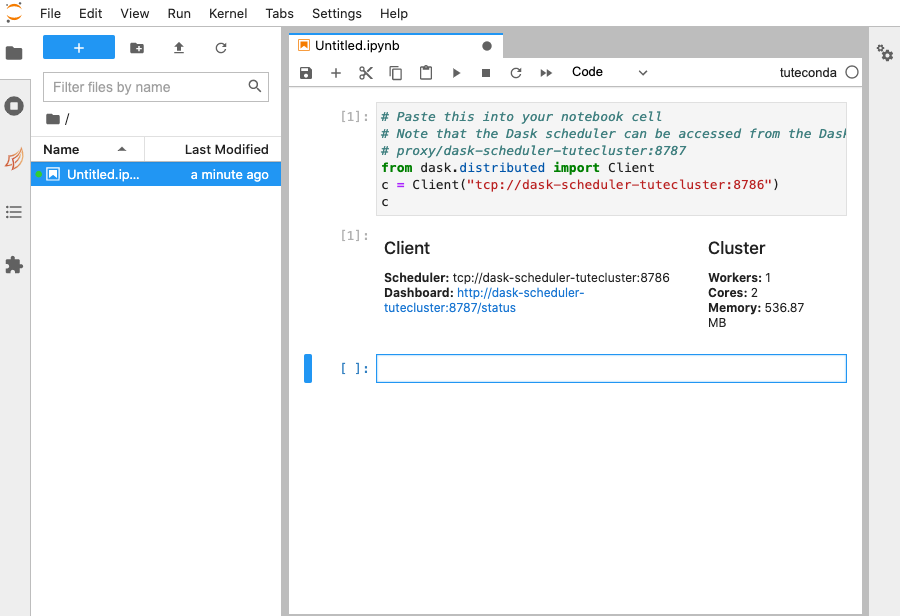

# 5. Access Dask Dashboard

In this section you will display the Dask dashboard,
in order to see the behaviour of the Dask cluster as it performs calculations.

Starting point: you should be logged in to DataLabs, in a project you have admin
permissions for, with a notebook client started from the cluster snippet.

On the left-hand side of the screen is a series of buttons,
one of which looks like two orange leaves (the Dask icon).
Select the Dask icon to open the Dask JupyterLab extension.

The bottom of the pane gives an alternative way to create Dask clusters.
We will not use this, as those Dask clusters do not have access to DataLabs storage,
and cannot use a project Conda environment.

However, we can use the extension to access the Dask dashboard.
In the pasted snippet text, there is a comment giving the Dask dashboard URL, which starts with `proxy/`...
Copy that address,
paste it into the `DASK DASHBOARD URL` textbox in the Dask JupyterLab extension,
and press return.
The various dashboard metrics will turn orange, indicating that they are available.

Double-click the **GRAPH** metric.
A new tab appears, showing you that the scheduler is not currently co-ordinating any work.

Although less convenient,
it is also possible to access the Dask dashboard directly through your browser.
Take your notebook URL, e.g.

`https://tutproj-tutnb.test-datalabs.nerc.ac.uk/lab`

and replace the `lab` with the Dask dashboard URL starting with `proxy/`,
and then append a final `/graph` to give

`https://tutproj-tutnb.test-datalabs.nerc.ac.uk/proxy/dask-scheduler-tutecluster:8787/graph`

This URL gives you direct browser access to the Dask dashboard.

Note that, for security reasons,
the cluster and the JupyterLab notebook must reside within the same project.
