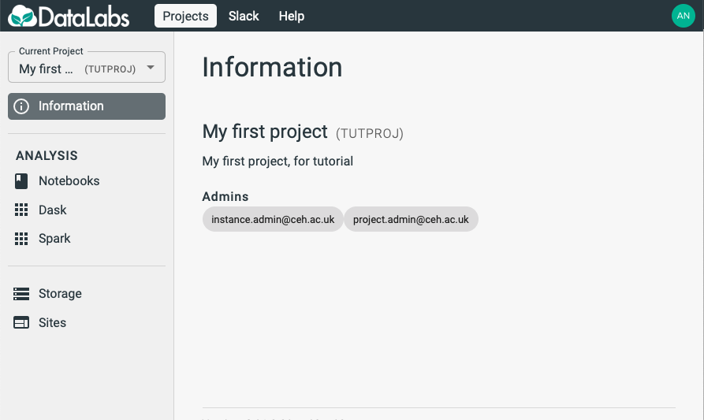
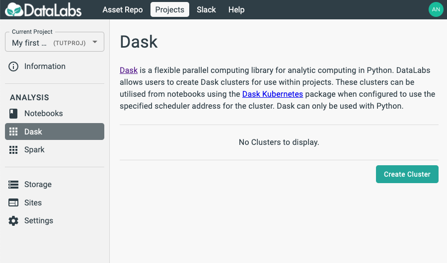
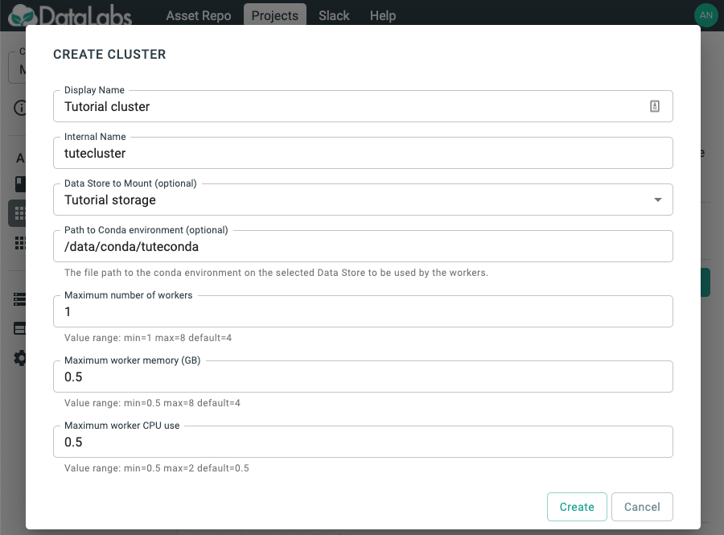
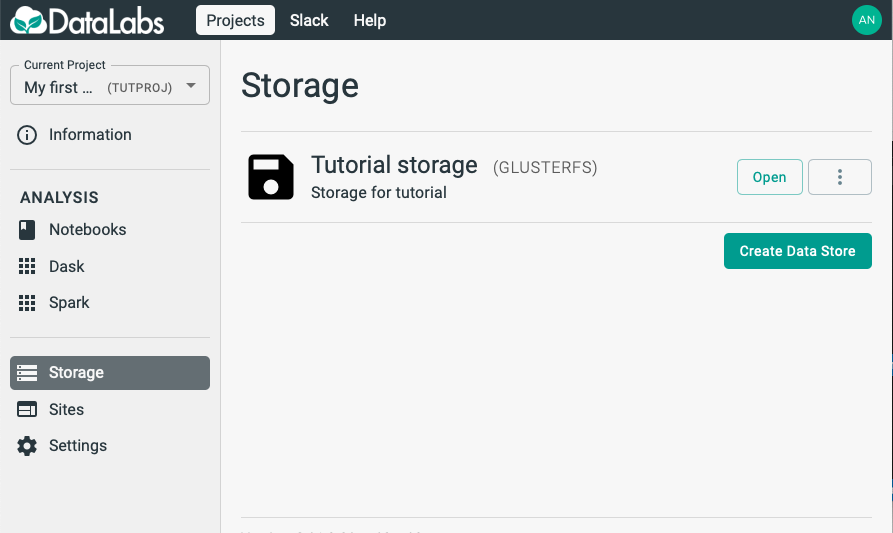

# 3. Create a Dask Cluster

In this section you will create a Dask cluster, in order to use it in your notebook.

Starting point: you should be logged in to DataLabs, in a project you have admin
permissions for.

On the left-hand-side, select **Dask**.

Select **Create cluster**, and fill out a form to create the Dask cluster.

Note that determining the optimum values for **Maximum number of workers**,
**Maximum worker memory**
and **Maximum worker CPU use** may require some trial-and-error.
If you are simply exploring functionality,
it is best to drop these parameters to their minimum values.
DataLabs will reserve the memory and CPU for each worker
(making those resources unavailable for other users),
and will scale the number of workers up from 1 to the maximum (and back down again)
depending on the load on the cluster.

Then select **Create**.

You will then be able to see the cluster that you have created.

