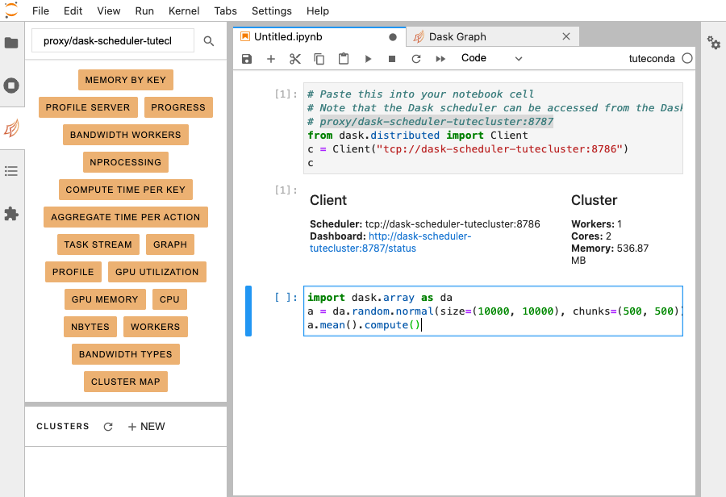
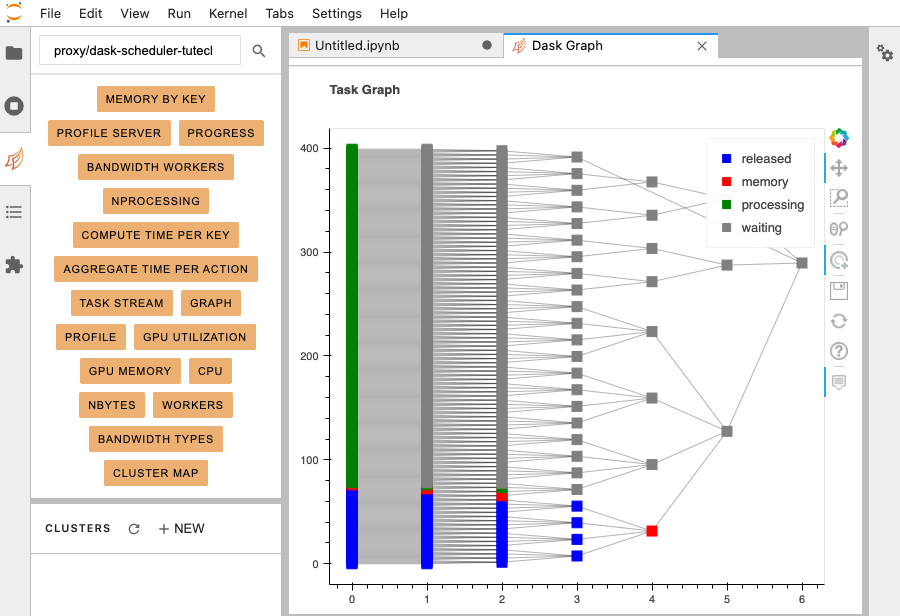

# 6. Perform Dask Calculation

In this section you will perform a Dask calculation,
observing the cluster behaviour via the Dask dashboard.

Starting point: you should be logged in to DataLabs, with a notebook client and a Dask dashboard.

Copy and paste the following text into the next cell:

```python
import dask.array as da
a = da.random.normal(size=(10000, 10000), chunks=(500, 500))
a.mean().compute()
```



Running this cell will perform the Dask calculation.
While the calculation is being performed,
you can observe the scheduler co-ordinating the work on the Dask Graph.



Back on the notebook tab, the Dask calculation will be outputted.


