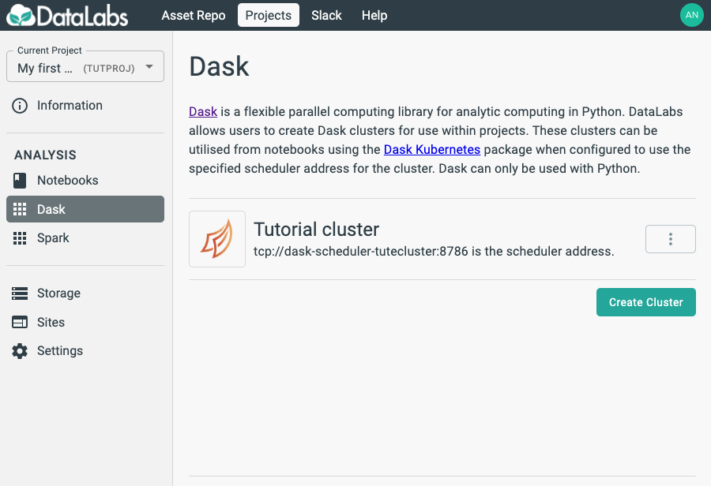
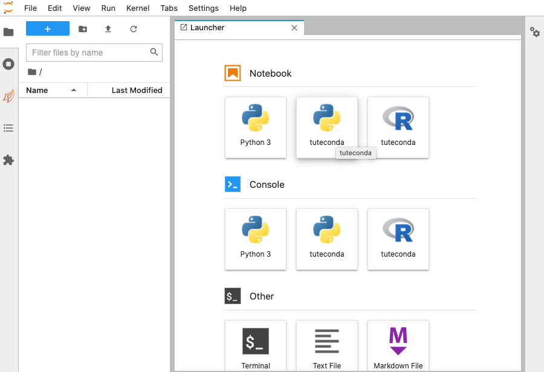
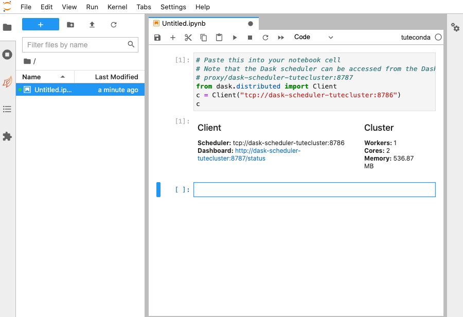

# 4. Start Dask Client

In this section you will start a Dask client, in order to use it to perform distributed calculations.

Starting point: you should be logged in to DataLabs, in a project you have admin
permissions for, with a notebook and cluster already created.

On the Dask cluster, select the triple-dot *More* menu and select **Copy snippet**.
This copies a useful snippet of code that you can use in your notebook.

In your JupyterLab,
start a notebook based on the same Conda environment that you used to create your cluster.

This will ensure that your cluster and your notebook have exactly the same environments.

Paste the contents of the clipboard into the notebook cell,
and run the notebook.

The output shows you that the Client and Cluster are contactable and ready for use.
