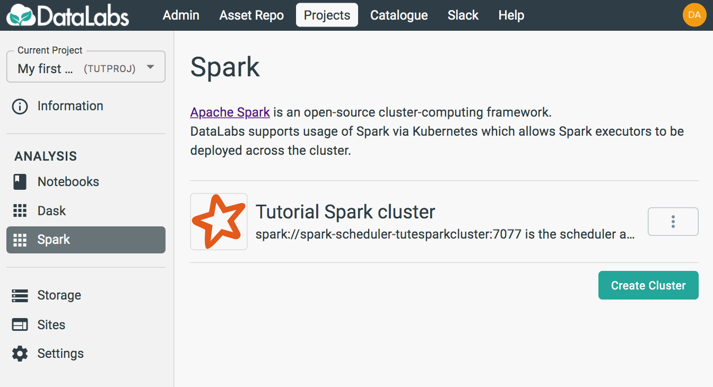
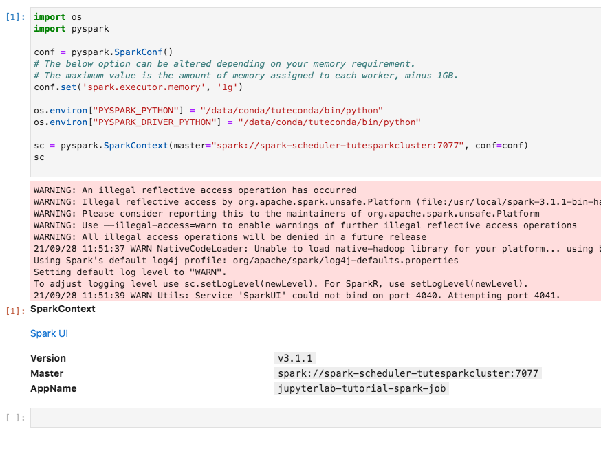
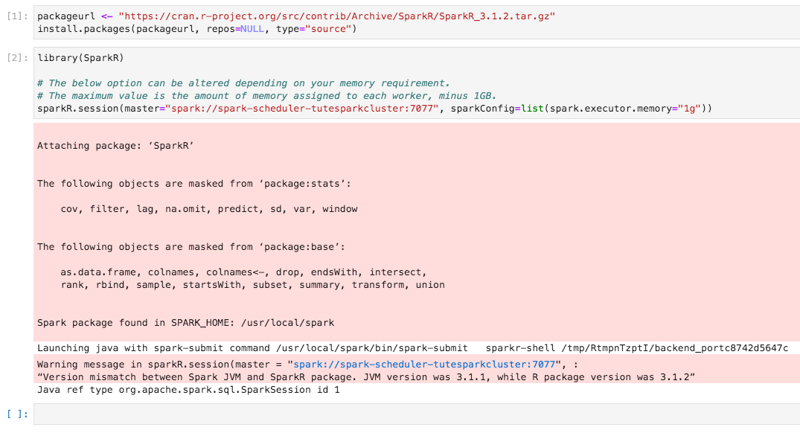

# 4. Start Spark Session

In this section you will start a Spark session, in order to use it to perform distributed calculations.

Starting point: you should be logged in to DataLabs, in a project you have admin
permissions for, with a notebook and Spark cluster already created.



Spark can be used from both Python and R. This section covers how to connect in each language

## Python

On the Spark page, find your cluster and select the triple-dot *More* menu and select **Copy Python snippet**.
This copies a useful snippet of Python code that you can use in your notebook.

In your JupyterLab,
start a Python notebook based on the same Conda environment that you used to create your cluster.


Paste the contents of the clipboard into the notebook cell,
and run the notebook.



The output shows you that the Spark Cluster is contactable and ready for use.

## R

n the Spark page, find your cluster and select the triple-dot *More* menu and select **Copy R snippet**.
This copies a useful snippet of R code that you can use in your notebook.

In your JupyterLab,
start an R notebook based on the same Conda environment that you used to create your cluster.


Paste the contents of the clipboard into the notebook cell,
and run the notebook.

Note: You may need to install the SparkR library, if so, you can use the following:

```r
packageurl <- "https://cran.r-project.org/src/contrib/Archive/SparkR/SparkR_3.1.2.tar.gz"
install.packages(packageurl, repos=NULL, type="source")
```



This sets the configuration for the spark "session" so subsequent calls will be made to the specified cluster.
