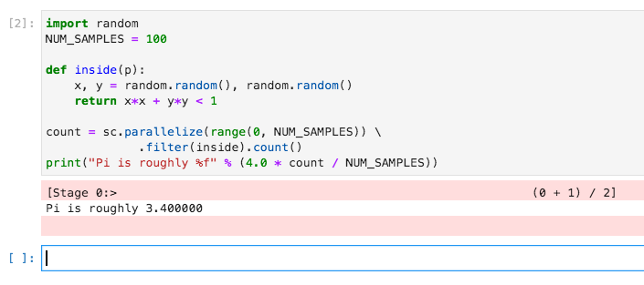

# Perform Spark Calculation (Python)

In this section you will perform a Spark calculation using Python.

Starting point: you should be logged in to Datalabs, with a JupyterLab Python notebook connected to a Spark cluster.

The below example is some code that estimates Pi by randomly picking points inside the unit square.
The proportion of those points that are also inside the unit circle is approximately pi/4.

Copy and paste the following into the next cell:

```python
import random
NUM_SAMPLES = 100

def inside(p):
    x, y = random.random(), random.random()
    return x*x + y*y < 1

count = sc.parallelize(range(0, NUM_SAMPLES)) \
             .filter(inside).count()
print("Pi is roughly %f" % (4.0 * count / NUM_SAMPLES))
```



To clear up resources, you can run the following to stop the context:

```python
sc.stop()
```
