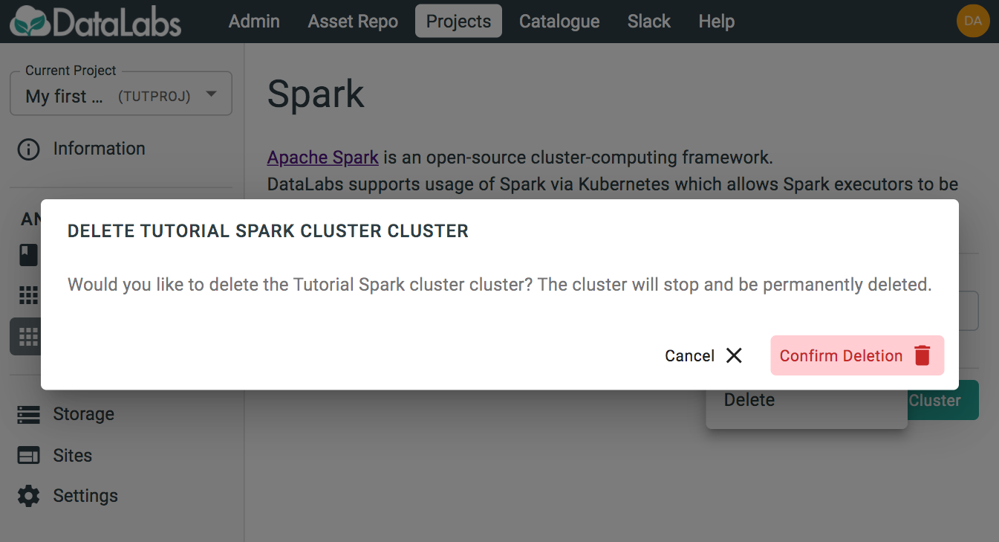

# 7. Delete Spark Cluster

In this section you will delete a Spark cluster, in order to free up resources.

Creating and using clusters is relatively straight-forward
and no data is stored in the cluster,
so clusters should be deleted when they are no longer required,
in order to free up resources for other users.

Starting point: you should be logged in to DataLabs, in a project you have admin
permissions for, and a cluster should already exist.

On the Spark cluster, select the triple-dot *More* menu and select **Delete**.

Select **Confirm deletion** to delete the Spark cluster.
