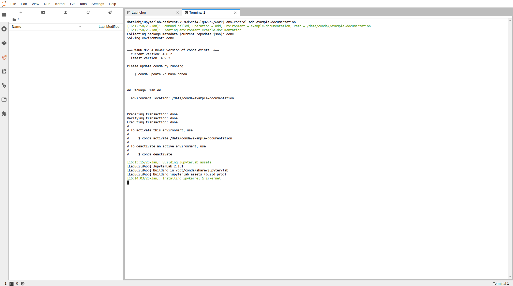

# 1. Create Conda Environment

Open a JupyterLab notebook from DataLabs, this should send you to a landing page. From
here, open up a terminal via `File > New > Terminal`. Within the terminal run the following
command;

```bash
env-control add new-environment
```

This will trigger the creation of a Conda environment as well as adding Jupyter
Kernels for both R & Python which are persisted on the data volume.
When running this for a brand new environment this is likely to take ~10 minutes
as it installs a number of dependencies.



Once the command is complete, refresh the page (F5) and browse to the Launcher
(`File > New Launcher`), from here you should see two new kernels which correspond
to the newly created Conda environment, one for each of Python and R.


