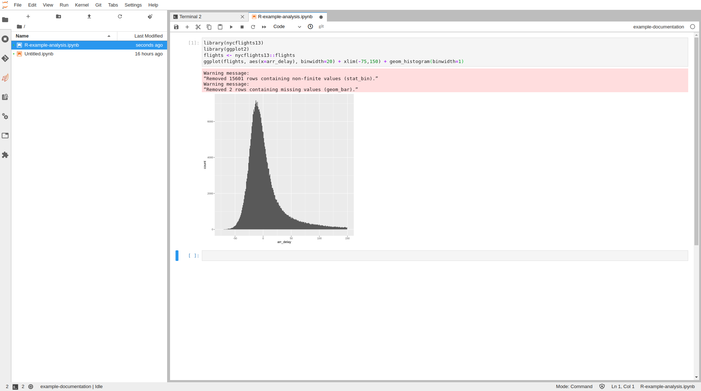

# 3. Example Analysis

Once you have a conda environment set up and some basic packages installed, you can begin
to create notebooks and carry out analysis.

## Python

The package `xarray` includes a number of example datasets that can be used to get used to
analysis in Jupyter, below shows a basic example for a simple plot around air temperature.

Paste this code into a Jupyter cell of a python notebook and run the contents (make sure that
you have installed the packages in the previous section).

```python
import numpy as np
import pandas as pd
import matplotlib.pyplot as plt
import xarray as xr
# Open air temperature dataset
airtemps = xr.tutorial.open_dataset("air_temperature")
air = airtemps.air - 273.15
air.attrs = airtemps.air.attrs
air.attrs["units"] = "deg C"
air1d = air.isel(lat=10, lon=10)
air1d.plot()
air1d[:200].plot.line("b-^")
```


## R

The package `nycflights13` contains data relating to flights from a US airport and can be used
to get used to handling data within R.

Past the code below into a cell of an R notebook and run the contents (ensure that the packages
in the previous section were installed first)

The below simply plots a histogram
of the time difference with arrival (negative is early), it represents something looking
like a normal distribution.

```R
library(nycflights13)
library(ggplot2)
flights <- nycflights13::flights
ggplot(flights, aes(x=arr_delay), binwidth=20) + xlim(-75,150) + geom_histogram(binwidth=1)
```



There are a number of [very good tutorials](https://rstudio-pubs-static.s3.amazonaws.com/262992_2f91dbebdffc4ca4ad2cde227f724b39.html)
which make use of the `nycflights13` dataset and help you get started with using a wide arrayy
of useful packages and techniques.
