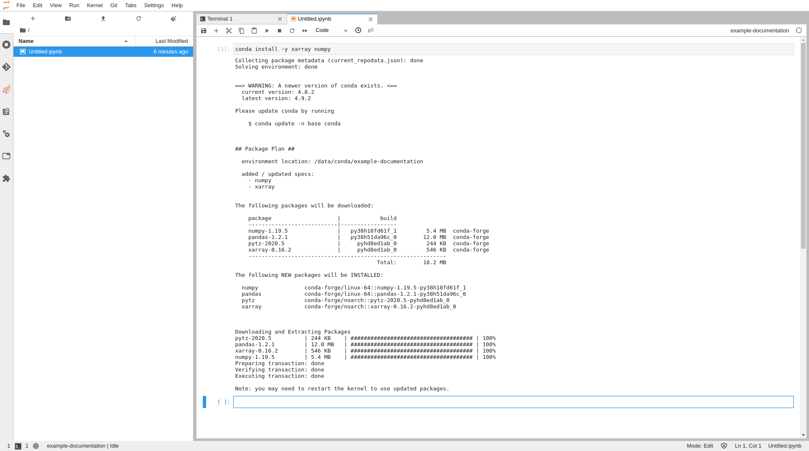

# 2. Install packages

After creating a conda environment you can then begin installing the packages
that you need to use.

There are multiple methods for installing packages in a Conda environment, but
this tutorial will cover the most basic case for both Python and R. In each case
we will install a few example packages which we will use later in an example.

## Python

From the launcher screen for Jupyter, select the kernel associated with the
environment you just created for Python. This will put you into a Python notebook
where we will install a few standard packages which are common for data analysis.

```python
conda install -y xarray numpy matplotlib pandas netcdf4
```



## R

In the case of R conda packages can be installed from a Terminal session,
this method differs slightly to the standard way that R packages are installed (generally
using commands such as `install.packages()` from the console, which does also work in most cases.)
But this method has advantages as it can install system dependencies as well. Note that when
installing R packages from Conda you must prefix the package name with `r-`.

```bash
source activate /data/conda/<environment_name>
conda install -y r-nycflight13 r-ggplot2
```


