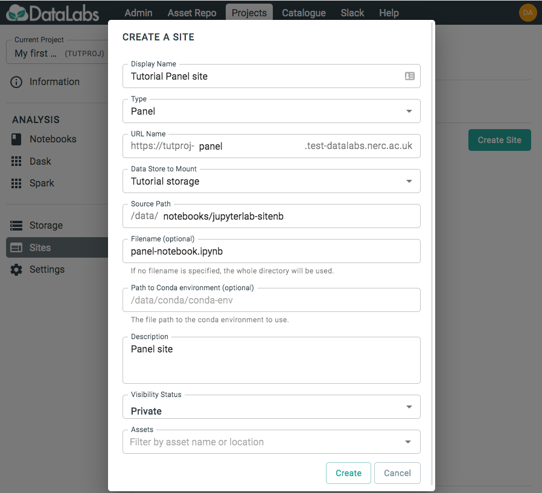
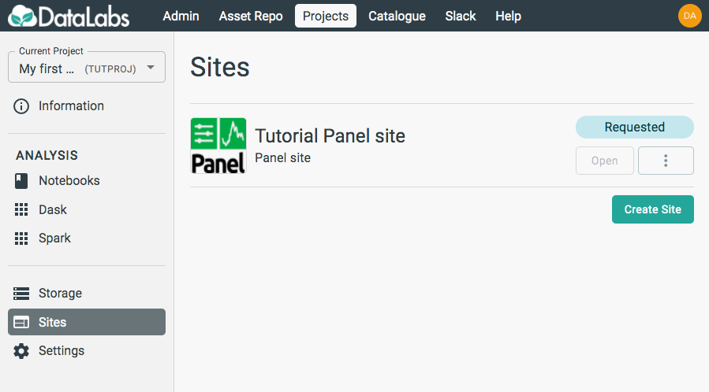

# 2. Create a Panel site

In this section you will create a Panel site.

Starting point: you should be logged in to DataLabs, in a project you have admin
permissions for. This project should contain a JupyterLab notebook containing the
code you want to host with Panel.

On the left-hand side, select **Sites**.

Select **Create Site** and fill out the form. In this form, the `Source Path`
should point to where your notebook code exists within your Project Storage,
for example `/data/notebooks/jupyterlab-notebook`.

By default, the Panel site will host all notebook files in the `Source Path`
directory, providing a landing page to choose which one to view.
You also have the option of choosing a specific file to host, meaning that
the site will only display that notebook. The site will still be able to
access other files in the directory if necessary, such as data files and
scripts.

In addition, you can choose a Conda environment to use for the kernel when
the notebook(s) is run on the site, allowing for the use of packages in that
Conda environment.
This environment is chosen at the top level, and Panel sites do not support
multiple kernels for different notebooks in the case that all notebooks in
the `Source Path` are displayed.

When happy with the settings, click **Create**.

Once created, you will be able to see your Site appear in the list, and
its status will change from `Requested` to `Ready` once it is available to
launch.

