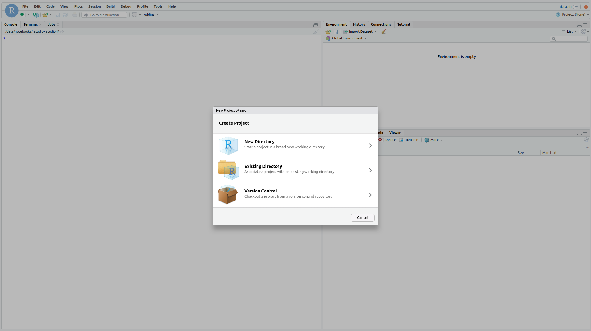
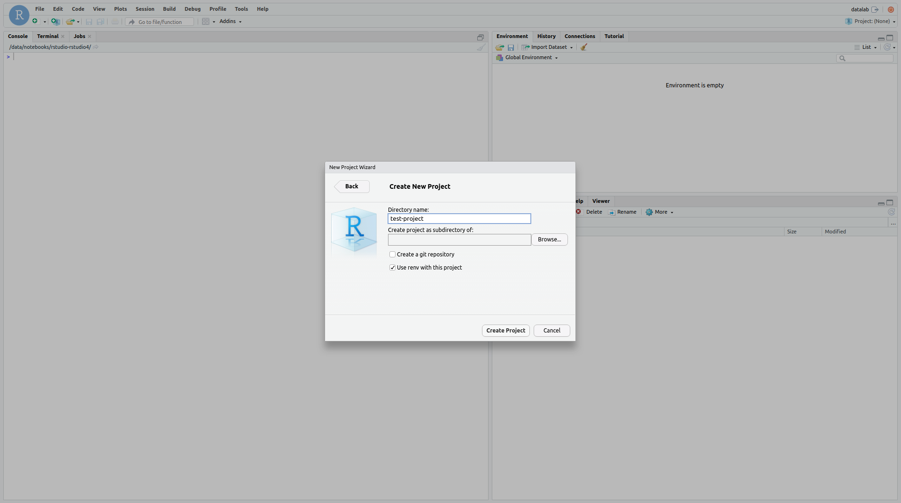

# 1. Create a new RStudio project

In this section you will create a new RStudio project. Projects are a concept within
RStudio for keeping everything related to one piece of work together and integrates
nicely with tools such as renv (and historically packrat).

Starting point: you should have been logged into DataLabs and created a new RStudio
notebook which has been opened.

Once in RStudio, create a new project by browseing to `File > New Project`, and selecting
`New Directory`. On the following form choose `New Project`.

After selecting this, enter a name for the directory the project will live in and browse
to select where the project directory will be saved (you may need to make a new folder).
At this point select the checkbox titled `Use renv with this project`, at which point
you can select `Create Project`.

This will trigger the creation of a new RStudio project and will also trigger a refresh
of your browser. Once the browser reloads you should be able to see in the top right underneath
`datalab` that the project you are currently using is the same name you entered initially.
