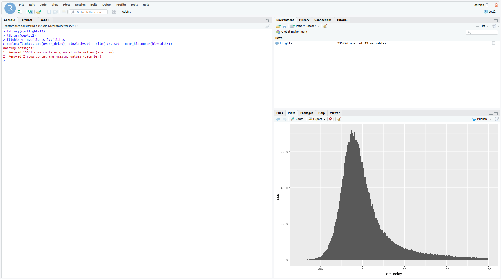

# 3. Example Analysis

Once you have a project set up and some basic packages installed, you can begin
to create R files and carry out analysis. A good place to start is simply
visualizing some data. The `nycflights13` package contains some good example
data relating to flights from a US airport.

Paste the code below into an R notebook and run it. It simply plots a histogram
of the time difference with arrival (negative is early), it represents something
looking like a normal distribution.

```R
library(nycflights13)
library(ggplot2)
flights <- nycflights13::flights
ggplot(flights, aes(x=arr_delay), binwidth=20) + xlim(-75,150) + geom_histogram(binwidth=1)
```



There are a number of [very good tutorials](https://rstudio-pubs-static.s3.amazonaws.com/262992_2f91dbebdffc4ca4ad2cde227f724b39.html)
which make use of the `nycflights13` dataset and help you get started with using a wide arrayy
of useful packages and techniques.
