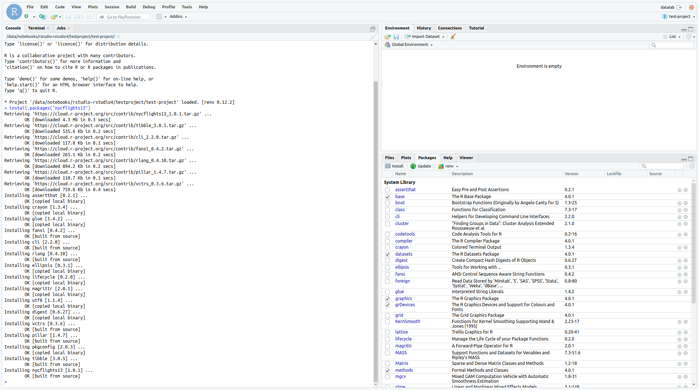

# 2. Install packages

Once you have loaded into your new project you can begin installing packages
that you will need. As renv is being used in this project any new packages
installed will by default be stored within the project directory without any
additional configuration. Hence they can be installed as per normal e.g

```R
install.packages("nycflights13")
install.packages("ggplot2")
```



At this point you can browse to `Packages` on the bottom right panel which will
show which packages are available in your R environment as well as their versions.
This area can also be used to install new packages if you prefer. Some standard
things to install can be analysis or visualization packages such as ggplot2 and
data.table.
