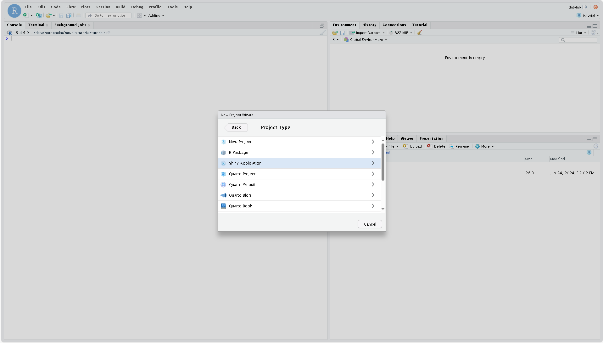
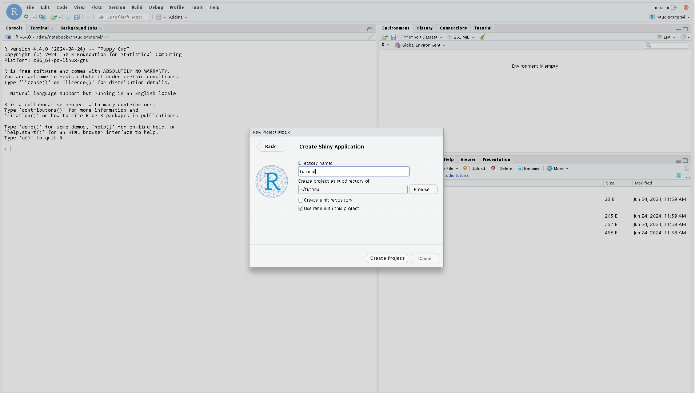
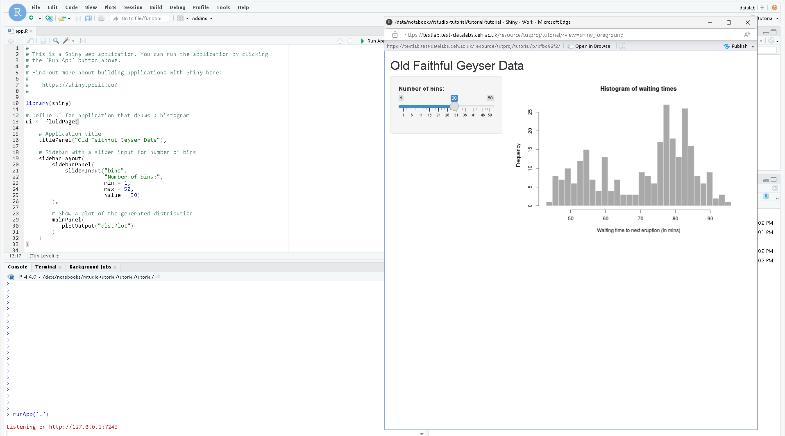
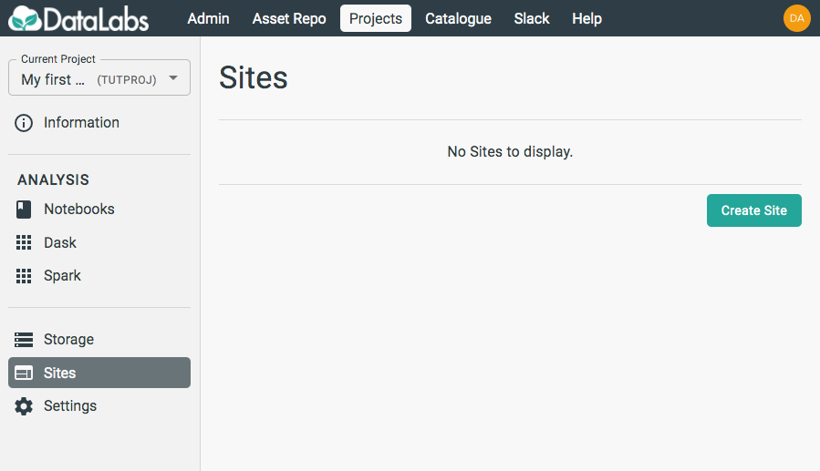
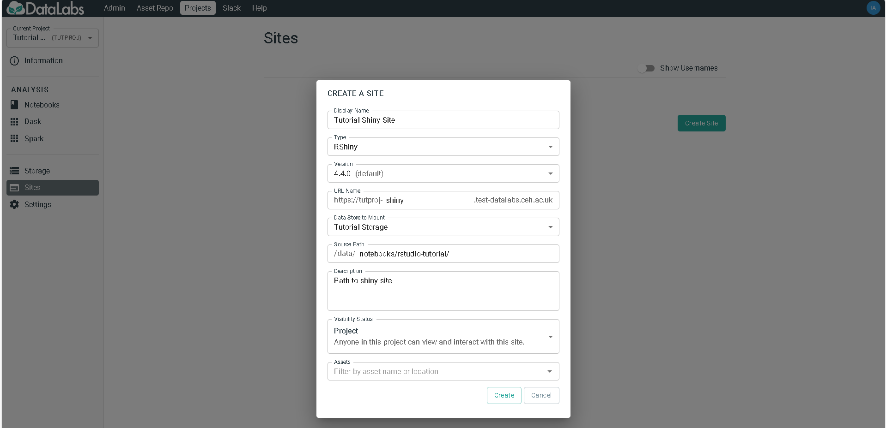
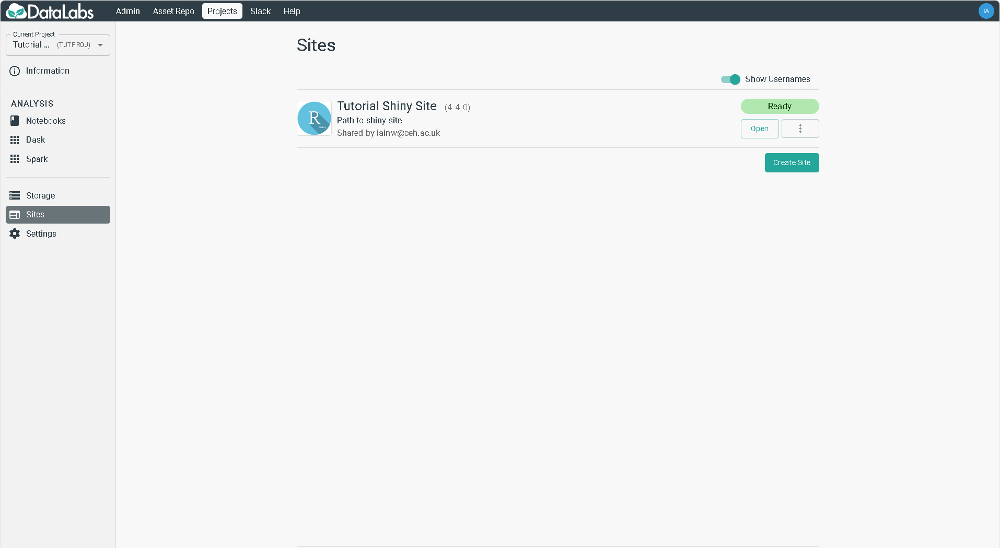

# 2. Create a Shiny site

In this section you will create a Shiny site.

Starting point: you should be logged in to DataLabs, in a project you have admin
permissions for. This project should contain a blank RStudio notebook.

In order to begin, open your RStudio notebook and create a new project ensuring
to select "Shiny". This will trigger some actions like initialising renv and may
take a few minutes.

***NOTE: When working on more advanced Shiny sites that use custom packages, you
should always enable `renv` when you create the RStudio project. This will track
all dependencies used in the project, and they can be loaded by the Shiny site once
it has been created by initialising `renv` in the Shiny code itself. While this isn't
required for this minimal example, generally it's advisable to work this way.***

Once complete, this should have generated a new folder with an existing `app.R`
file in which serves as a good example on how to work with Shiny.

Next from DataLabs, on the left-hand side, select **Sites**.

Select **Create Site** and fill out the form. In this form, the `Source Path`
should point to where your app.R code exists within your Project Storage,
for example `/data/notebooks/rstudio-notebook/tutorial`. (Assuming the project
created in RStudio was called tutorial)

By default, the Shiny site will look for app.R or main.R/server.R. If nothing
is present it will simply show a blank index page. The site will still be able to
access other files in the directory if necessary, such as data files and
scripts.

When happy with the settings, click **Create**.

Once created, you will be able to see your Site appear in the list, and
its status will change from `Requested` to `Ready` once it is available to
launch.

