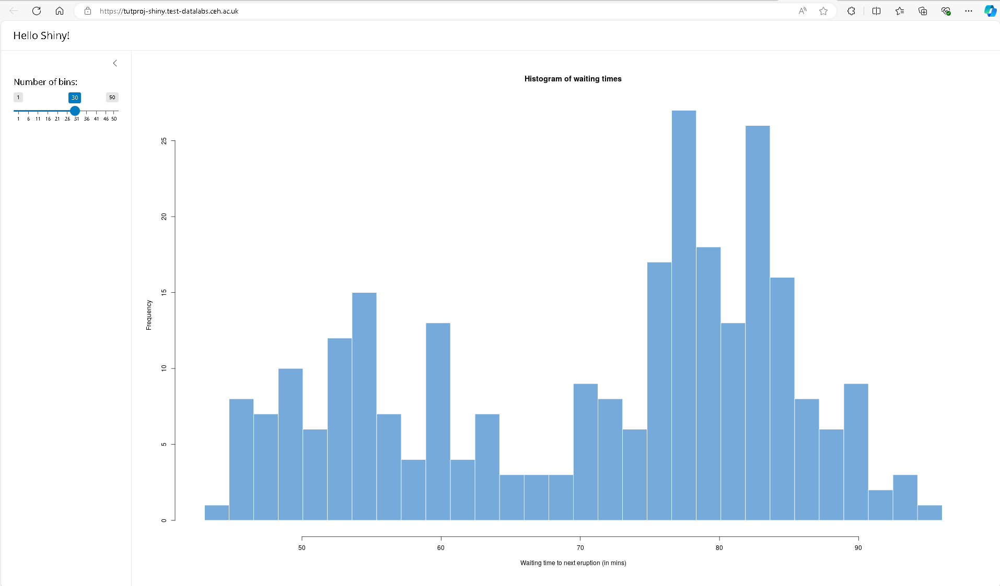

# 3. Launch Shiny

In this section you will launch a Shiny site.

Starting point: you should be logged in to DataLabs, in a project you have at least
viewer permissions for. This project should contain a Shiny site connected to a
RStudio notebook.

On the left-hand side, select **Sites**.

Click on **Open** on your Shiny site.

You should be able to see the default Shiny example histogram successfully loaded.
