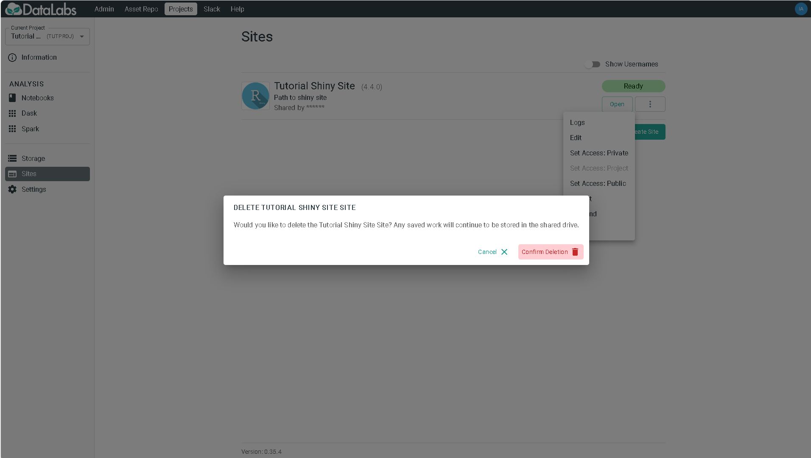

# 4. Delete Shiny site

In this section you will delete a Shiny site.

As sites are driven by the contents of a notebook and doesn't contain the code
itself, they can be deleted when they are no longer needed.

Starting point: you should be logged in to DataLabs, in a project you have admin
permissions for, and a Shiny site should already exist.

On the Shiny site, select the triple-dot *More* menu and select **Delete**.

Select **Confirm deletion** to delete the Shiny site.
