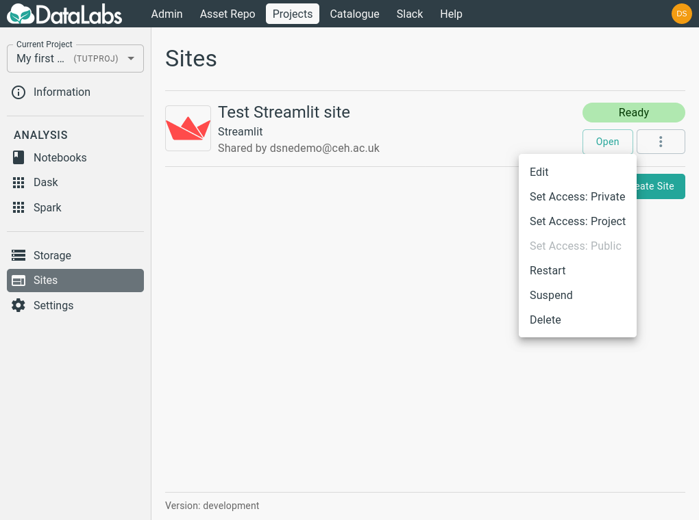

# Launch, edit and delete a Streamlit site

Once a site has been created, it can be viewed, edited and opened from
the **Sites** page:

**Due to technical limitations in the DataLabs platform, Streamlit
apps do not automatically update when changes are made to the
underlying Python file.**

To see the results of editing your site, you need to restart the site
by clicking the **Restart** button.

Streamlit sites contain no data or state that is not stored on the
associated storage, so when no longer needed, it is safe to delete it
by pressing the **Delete** button.
