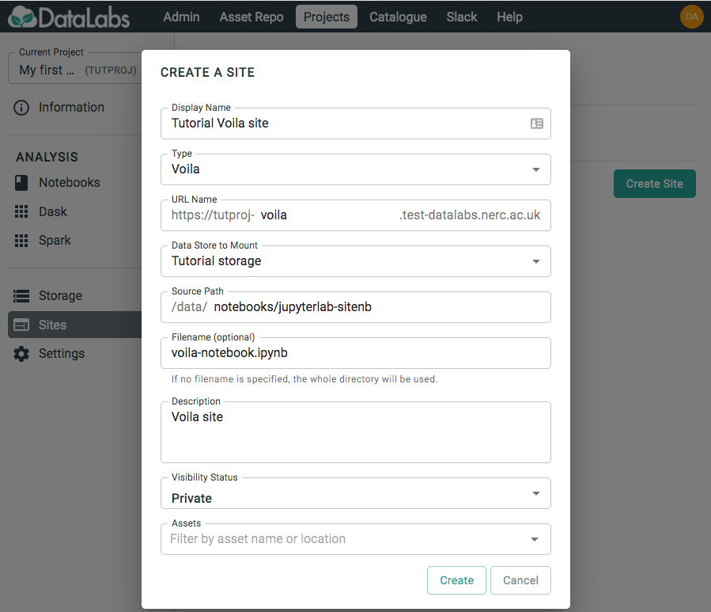
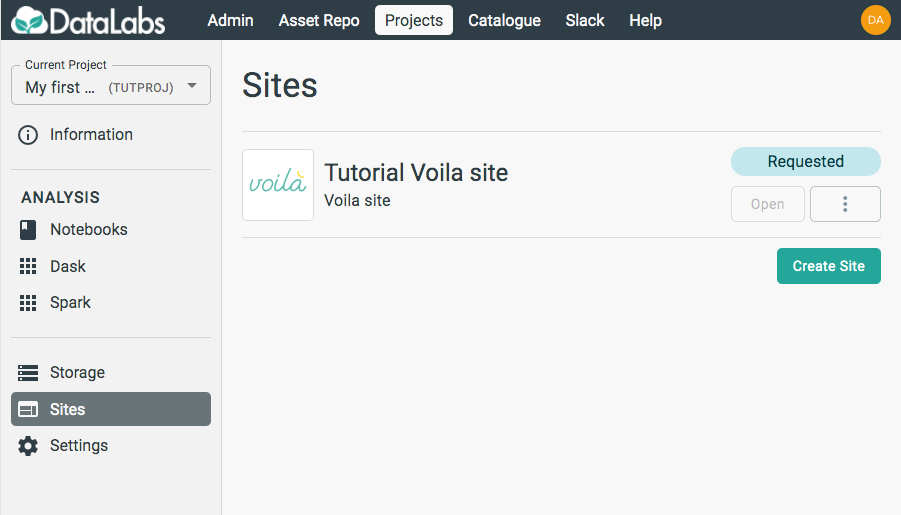

# 2. Create a Voilà site

In this section you will create a Voilà site.

Starting point: you should be logged in to DataLabs, in a project you have admin
permissions for. This project should contain a JupyterLab notebook containing the
code you want to host with Voilà.

On the left-hand side, select **Sites**.

Select **Create Site** and fill out the form. In this form, the `Source Path`
should point to where your notebook code exists within your Project Storage,
for example `/data/notebooks/jupyterlab-notebook`.

By default, the Voilà site will host all notebook files in the `Source Path`
directory, providing a landing page to choose which one to view.
You also have the option of choosing a specific file to host, meaning that
the site will only display that notebook. The site will still be able to
access other files in the directory if necessary, such as data files and
scripts.

Note that Voilà sites will automatically pick up and use the kernel
associated with the select notebook. So, if a particular notebook requires
a Conda environment, it will use this.

When happy with the settings, click **Create**.

Once created, you will be able to see your Site appear in the list, and
its status will change from `Requested` to `Ready` once it is available to
launch.

