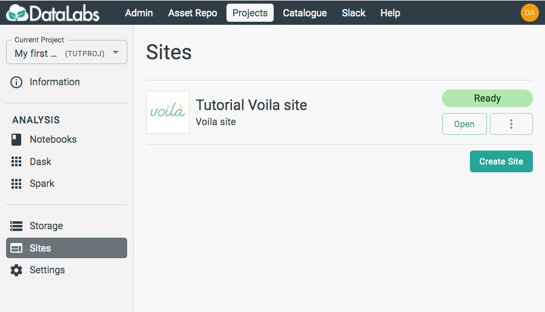
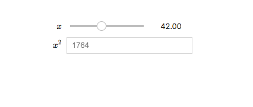
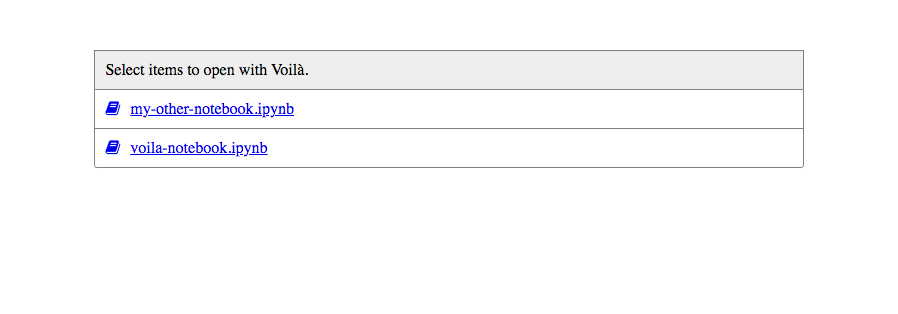

# 3. Launch Voilà

In this section you will launch a Voilà site.

Starting point: you should be logged in to DataLabs, in a project you have at least
viewer permissions for. This project should contain a Voilà site connected to a
JupyterLab notebook.

On the left-hand side, select **Sites**.

On this page, you should see any Sites you have access to view.
Click on **Open** on your Voilà site.

If the site was created with a specific notebook file, then the launched page might
look something like the above image. In this case, we have an interactive slider
which is the output of a cell in the notebook that is being hosted.

If the site was created without a specific file, then all notebooks in the chosen
directory will be available to view. The default landing page looks something like
the above image, and selecting a notebook will launch it.
