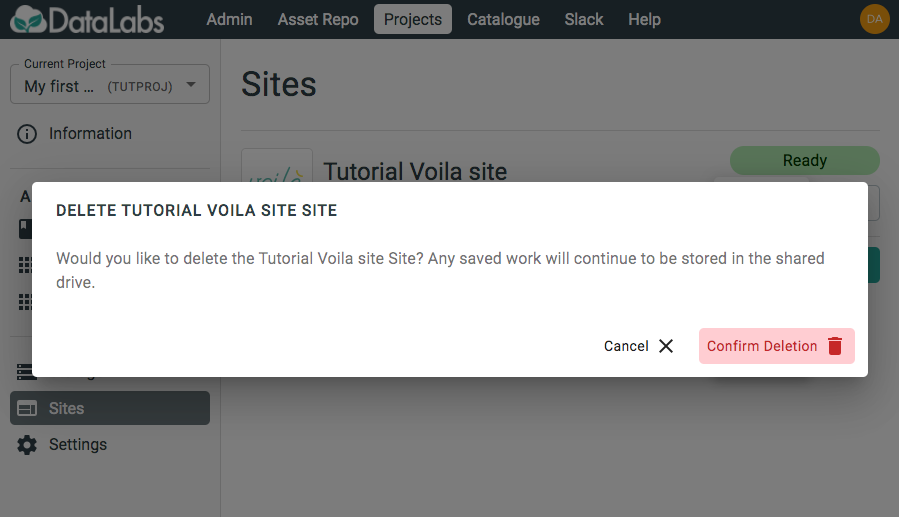

# 4. Delete Voilà site

In this section you will delete a Voilà site.

As sites are driven by the contents of a notebook and doesn't contain the code
itself, they can be deleted when they are no longer needed.

Starting point: you should be logged in to DataLabs, in a project you have admin
permissions for, and a Voilà site should already exist.

On the Voilà site, select the triple-dot *More* menu and select **Delete**.

Select **Confirm deletion** to delete the Voilà site.
