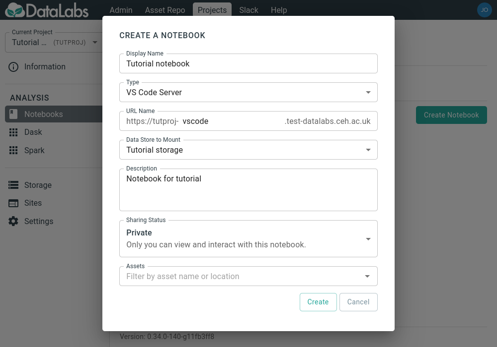
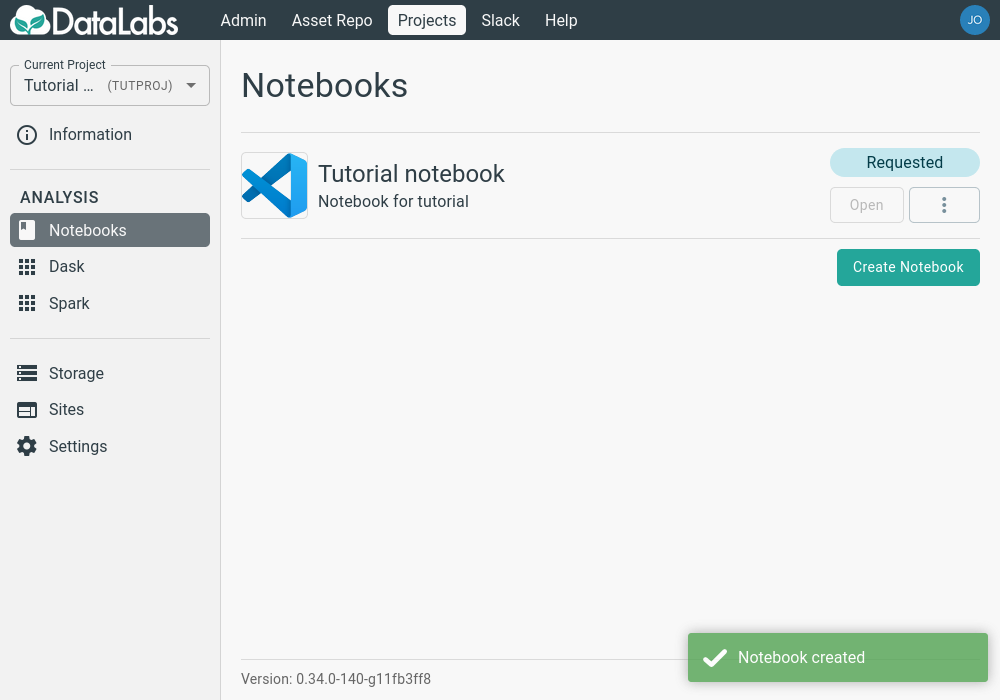
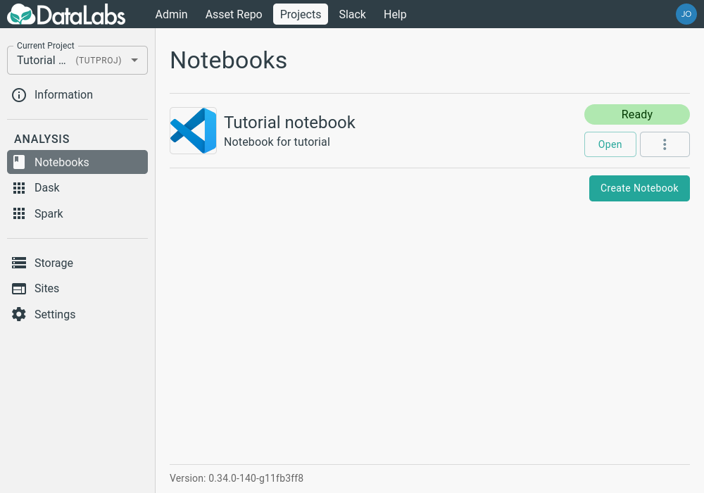

# 1. Create a new Visual Studio Code Notebook

In this section you will create a new Visual Studio Code notebook.
Like JupyterLab notebooks, Visual Studio Code notebooks require a
storage area to save their configuration and environment in, so make
sure you are logged into a project and have [created some
storage](../my-first-notebook/create-project-storage.md).

Click on the Create Notebook button in the Notebooks section and fill
out the form, making sure to choose VS Code Server as the Type.

When you have entered all the required details, click the Create
button, and the notebook will be requested.

After a few minutes, the notebook will have been created and will be
ready to be opened.

