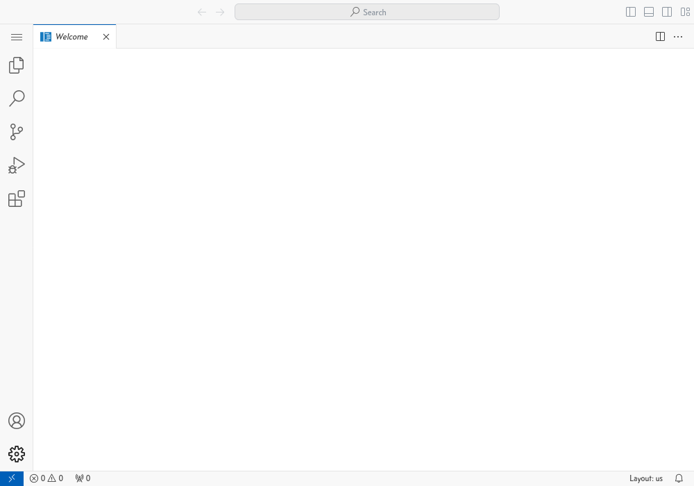

# 2. Start editing with Visual Studio Code

Once you have [created a Visual Studio Code
notebook](create-notebook.md), you can launch it by clicking the Open
button on the right.  **As with JupyterLab, you may have to enable
pop-ups for this site.**

An instance of Visual Studio Code will open in a new browser tab.

You can then create a notebook or script file, and edit it as normal
in Visual Studio Code.  You can install extensions and create and use
Conda environments as though Visual Studio Code was running on your
own computer.
