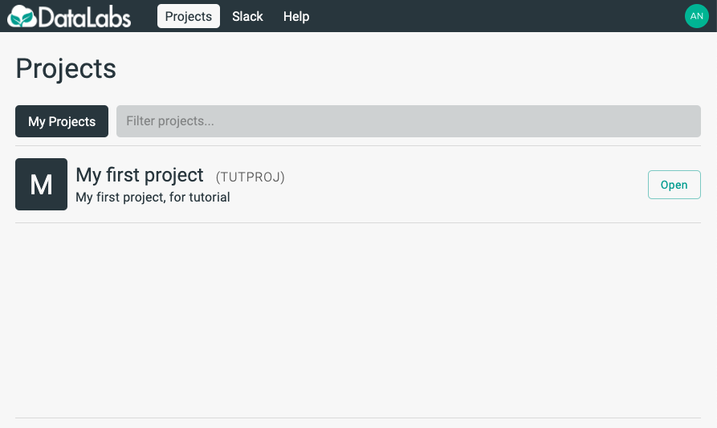

# 3. Access a project

In this section you will ensure you have access to a project.
A project is a container for your storage and notebooks, allowing for sharing and
collaboration with other users.

Starting point: you should be logged in to DataLabs, at the projects home page.

If you already have a project, it will be visible on your projects home page:

If you do not already have a project, you should ask an administrator to create a project
for you.  Once that has happened, you can proceed with the tutorial.
