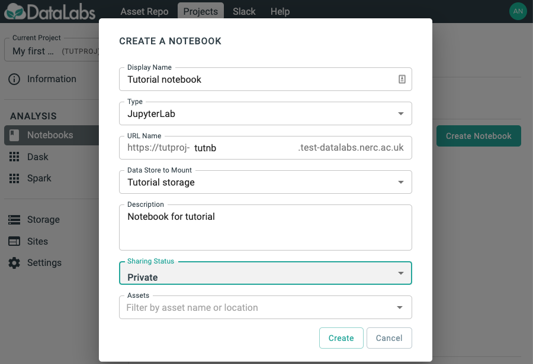

# 6. Create a JupyterLab

In this section you will create a JupyterLab notebook.

Starting point: you should be logged in to DataLabs, in a project you have admin
permissions for, with some project storage already created.

On the left-hand-side, click the Notebooks link.

Click the Create Notebook button, and fill out a form to create a notebook.
__For Type, select JupyterLab.__
Then click the Create button.

You will then be able to see the notebook that you have created.

Initially the notebook will have a status of requested.
You will have to wait a few minutes for the status to change to Ready before continuing
with the tutorial.

