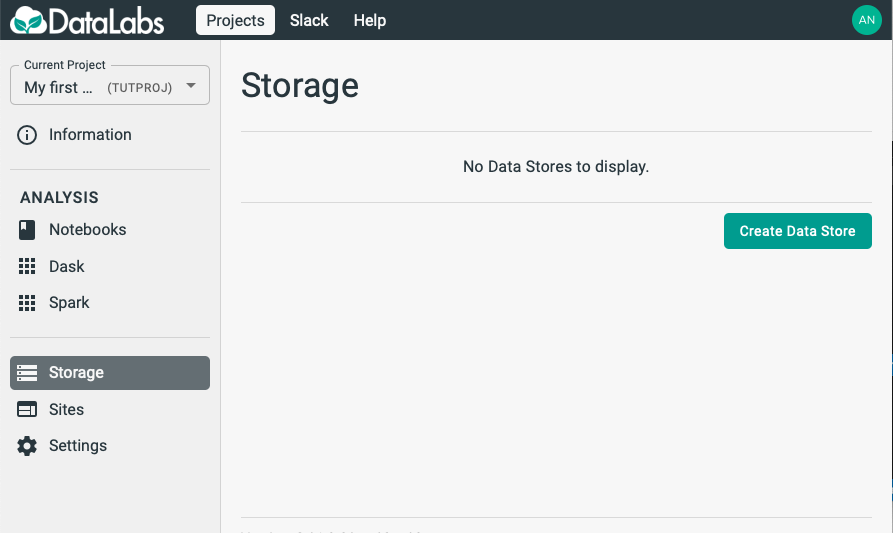
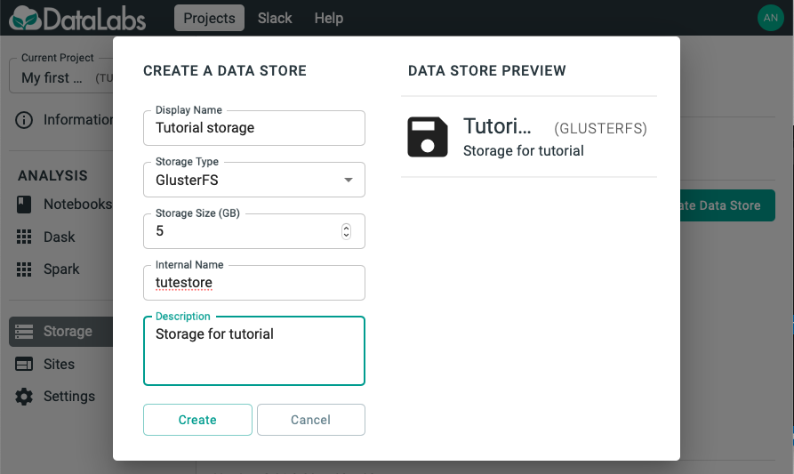

# 5. Create project storage

In this section you will create some project storage, in order to store your notebook.

Starting point: you should be logged in to DataLabs, in a project you have admin
permissions for.

On the left-hand-side, click the Storage link.

Click the Create Data Store button, and fill out a form to create storage.
Then click the Create button.

You will then be able to see the storage that you have created.

