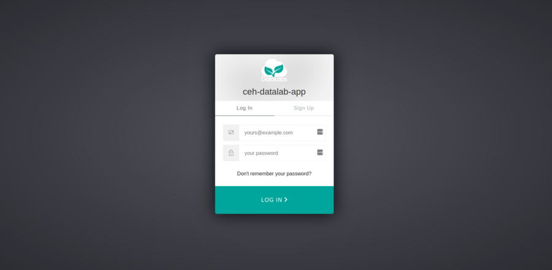

# 2. Log in to DataLabs

In this section you will log in to DataLabs.

__If you have already logged in to DataLabs, you can skip this section.__

1. Starting point: you should already have a DataLabs account.
If you have just finished the preceding section, you will already be on the auth0 log in page.
Otherwise, navigate to <https://datalab.datalabs.ceh.ac.uk> (or whatever your local
instance of DataLabs is), and click the Log In button.

1. You will then be taken to a page asking you to enter your username (email address) and password.

1. Enter your email address and password, and click the LOG IN button.
You will then arrive at the DataLabs Projects page.

