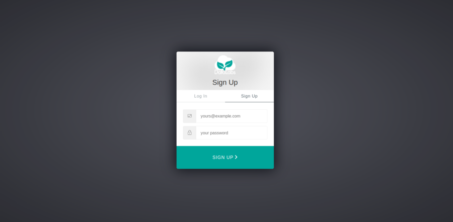

# 1. Sign up to DataLabs

In this section you will obtain a DataLabs account.

__If you already have a DataLabs account, you can skip this section.__

1. In your browser, navigate to <https://datalab.datalabs.ceh.ac.uk> (or whatever your
local instance of DataLabs is).

1. Click the Sign Up button.
Depending on your local instance of DataLabs, follow the instructions to create an account.

For CEH DataLabs, you will be taken to a page on auth0.com:

1. Navigate to the Sign Up tab, and enter an email address (this will be your username)
and a password.
The email address must be for an account you can access, as you will be sent a
verification email.  

1. You will then be taken to a page asking you to verify your email address.

1. In your email client, you should receive an email with a verification link or button,
which you should click.
You will be taken to a page informing you that your email was verified.

1. Back on the DataLabs page, you can now click the "I've verified my email button".
This will take you to a login page.

