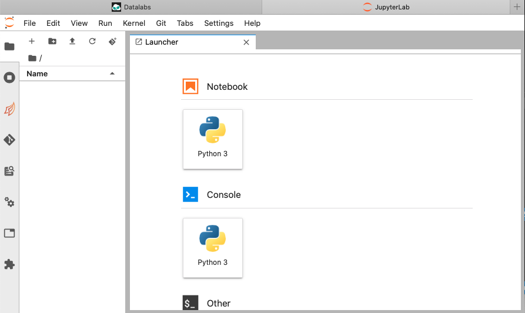
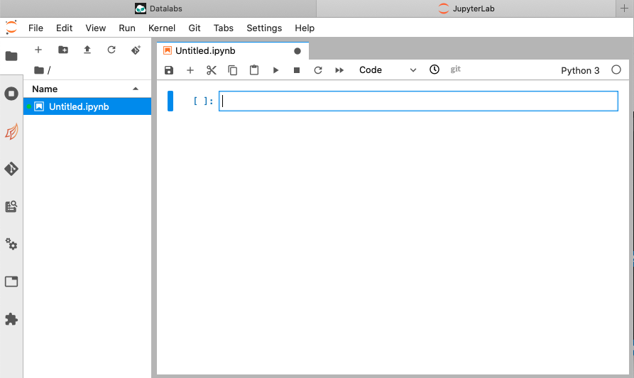

# 7. Start a Jupyter notebook

In this section you will start a Jupyter notebook.

Starting point: you should be logged in to DataLabs, in a project you have admin
permissions for, with some project storage and a JupyterLab notebook already created.

On the right hand side, click the Open button.
__If your browser prevents pop-ups, you may have to enable pop-ups for this site__.
On a new browser tab, a JupyterLab launcher should open.

Click the Python 3 button.
Within JupyterLab, a Python Jupyter notebook is created.

You can enter a Python calculation in the cell, and then click the 'Play' button on the
Jupyter menu bar to execute the cell contents.

